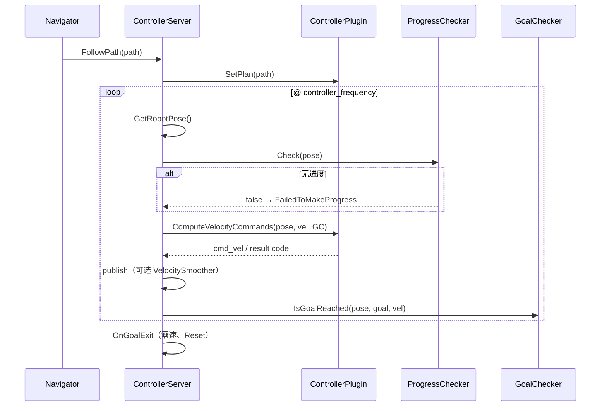

(control-architecture)=
# 2. Control 模块架构

> 上手与配置见 [§0](00_guide.md)；Checker / Smoother / 控制器见 [§3–§5](03_checkers.md)。本文只写 **边界、分层、FollowPath 循环、插件加载、错误与扩展**。

---

## 2.1 在导航栈中的位置

```
Planning ──Path──► ControllerServer ──FollowPath──► ControllerInterface
                        │                                    │
                        │◄── odom / TF ── localization       │
                        │                                    ▼
                        ├── GoalChecker / ProgressChecker   Costmap2DWrapper
                        ├── VelocitySmoother（可选）              ▲
                        ▼                                    │
                   cmd_vel ──► 底盘              map / 共享 global costmap
                        ▲
                 Navigator BT
```

| 边界 | 说明 |
|------|------|
| 上游 | Navigator（FollowPath）、Planning（`Path`）、localization（位姿/odom） |
| 地图 | `map/costmap_2d`；独立 `/local_costmap` 或 `SetSharedCostmap()` 共享全局图 |
| 下游 | 底盘、`VelocitySmoother`（可选） |
| 入口 | `Autonomy` 构造 `ControllerServer`（`AUTONOMY_CONTROLLER`） |

| 设计约束 | **nav2 对齐** · **`ControllerInterface` 插件化** · **Checker 与控制器解耦** · **`controller.lua` → ControllerOptions** · Planning 出几何 Path、Control 出轨迹/时空联合（[§0.7](00_guide.md#07-问题形式化)） |

---

## 2.2 分层与实现状态

```
Navigator → ControllerServer → ControllerInterface ──读── Costmap2DWrapper
                │                      │
                ├── GoalChecker        └── SetPlan(Path)
                ├── ProgressChecker
                └── VelocitySmoother（可选后处理）
```

| 层 | 组件 | 职责 |
|----|------|------|
| 服务 | `ControllerServer` | FollowPath 循环、插件调度、TF/odom、失败容忍 |
| 算法 | `ControllerInterface` | `ComputeVelocityCommands()`、`SetPlan()` |
| 判定 | `GoalChecker` / `ProgressChecker` | 到达 / 进度（独立于控制器，可单测） |
| 地图 | `Costmap2DWrapper` | 碰撞检测；local 或共享 global |
| 后处理 | `VelocitySmoother` | 加速度界、deadband；见 [§4](04_velocity_smoother.md) |

| 组件 | 状态 | 说明 |
|------|------|------|
| `ControllerServer` 骨架 | ✅ | 构造、TF、odom、costmap |
| FollowPath / `ComputeControl()` | ⏳ | 主循环 stub |
| 控制器插件加载 | ⏳ | 接口已定，待接 PluginManager |
| Goal / Progress Checker | ✅ | 算法就绪；Lua 接线 ⏳ |
| `VelocitySmoother` | ✅ | 算法就绪；节点接线 ⏳ |
| 控制器插件实现 | ❌ | 无具体类 |

节点 `controller_server` · 话题 `cmd_vel` / `odom` · Action FollowPath（设计意图，见 [§0.16](00_guide.md#016-通信接口设计意图)）。

---

## 2.3 FollowPath 控制循环



| 阶段 | 位置 | 说明 |
|------|------|------|
| 初始化 | `ControllerServer` | `SetPlan`、Reset checker / controller |
| 位姿 | `GetRobotPose` | odom 优先，fallback costmap TF |
| 进度 | `ProgressChecker` | `false` → `FailedToMakeProgress` |
| 控制 | `ControllerInterface` | 读 costmap、路径；返回 `ControllerResultCode` |
| 到达 | `GoalChecker` | 循环退出条件 |
| 收尾 | `OnGoalExit` | 零速、`publish_zero_velocity` 策略 |

循环周期 $T=1/f_{ctrl}$（默认 20 Hz，`controller_frequency`）。连续 $t>T_{\mathrm{fail}}$ 无有效命令则终止（`failure_tolerance`）。流水线概览见 [§0.9](00_guide.md#09-控制流水线)。

---

## 2.4 插件与配置

### 2.4.1 控制器插件（配置预留）

| 插件 ID（示例） | 类型 | 文档 |
|-----------------|------|------|
| `graceful_controller` | 平滑跟踪 | [§10](controller/10_graceful_controller.md) |
| `mppi_controller` | 采样 MPC | [§11](controller/11_mppi_controller.md) |
| `regulated_pure_pursuit` | RPP | [§12](controller/12_rpp_controller.md) |

完整列表与选型见 [§5](05_controller_algorithms.md)。

### 2.4.2 加载链

```
controller.lua → ControllerOptions → ControllerServer
    → controller_plugin_libraries → PluginManager
    → CreateInstance<ControllerInterface>()
```

条目格式：`"graceful_controller:GracefulController"` 或 `"my_id:MyClass"`。Goal / Progress Checker 以独立 `map<id, plugin>` 管理，模式同 [Planning §1.4.2](../08_Planning/01_architecture.md#142-加载链)。

```cpp
auto [id, type] = ParsePluginSpec(spec);
plugin_manager.RegisterInProcessClass<MyController>(type);
auto ctrl = plugin_manager.CreateInstance<ControllerInterface>(
    type, options, id, tf_buffer, costmap_wrapper);
controllers_[id] = ctrl;
```

配置字段与 API 见 [§0.12–§0.14](00_guide.md#012-配置)。

---

## 2.5 错误处理

| 异常 | 触发 |
|------|------|
| `InvalidController` | 插件 id 无效 |
| `ControllerTFError` | TF 查询失败 |
| `FailedToMakeProgress` | `ProgressChecker::Check` 为 false |
| `InvalidPath` | 空路径 |
| `NoValidControl` | 控制器无效 / 连续失败超 `failure_tolerance` |
| `ControllerTimedOut` | costmap 未 current |

`ControllerResultCode`（SUCCESS / NO_VALID_CMD / COLLISION / …）见 [§0.14](00_guide.md#014-controllerinterface-插件-api)。现象排查见 [§0.19](00_guide.md#019-故障排查)。

---

## 2.6 扩展自定义控制器

1. 继承 `ControllerInterface`，实现 `ComputeVelocityCommands()`、`SetPlan()` 等
2. `AUTOLINK_PLUGIN_MANAGER_REGISTER_PLUGIN(MyController, ControllerInterface)`
3. `controller.lua` 的 `controller_plugins` 注册 id

步骤摘要亦见 [§0.17](00_guide.md#017-自定义控制器插件)。实现优先级见 [§5.9](05_controller_algorithms.md#59-实现路线建议)。

---

## 2.7 相关文档

- [§0 指南](00_guide.md) · [§3 Checker](03_checkers.md) · [§5 控制器](05_controller_algorithms.md) · [§6 综述](06_survey.md)
