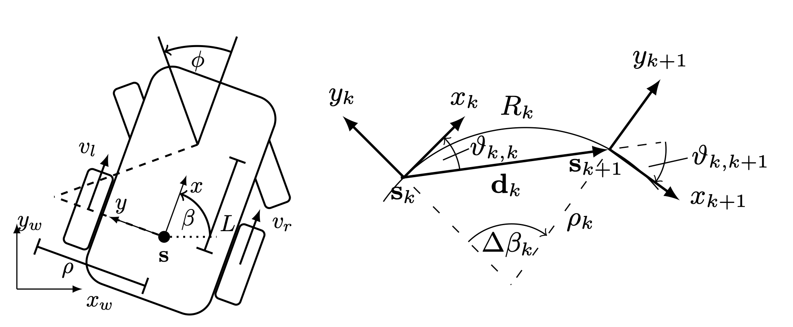
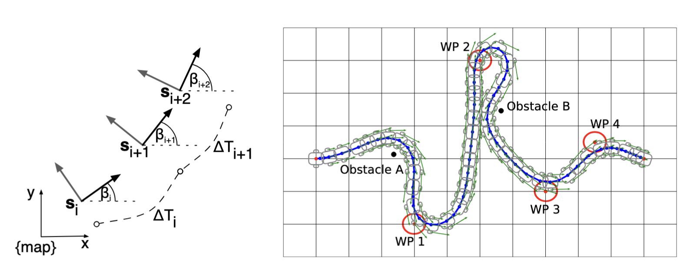
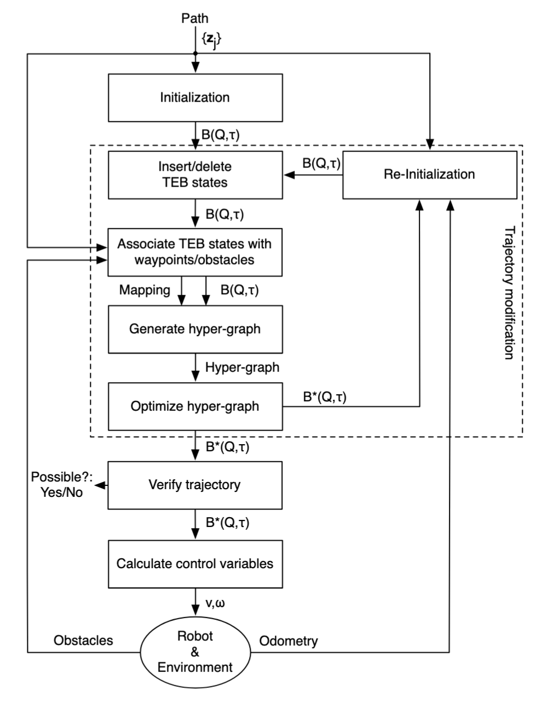
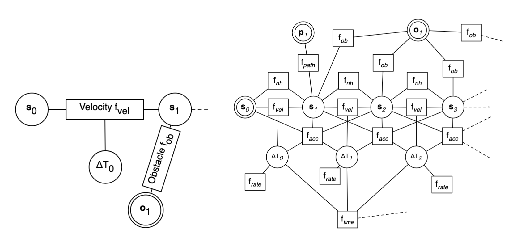
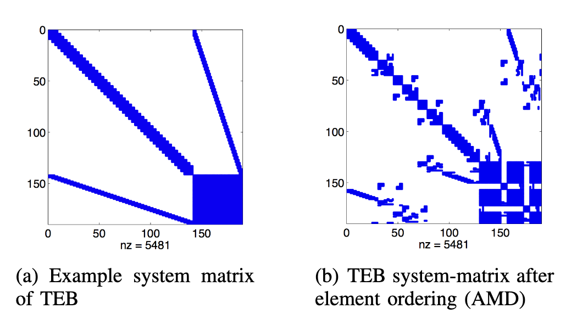

# 14. TEB Controller

> 归属 [§8.6 TEB](../08_controller_algorithms.md#86-tebtimed-elastic-band) · Autonomy ❌ 未实现
>
> **Timed Elastic Band**（TEB）在全局路径初值上在线 deform **轨迹**（位姿序列 + 过渡时间 $\Delta T_k$），将 car-like / 差速平台的 kinodynamic 约束与避障统一为有限维稀疏优化；内层 LM 迭代 + 状态反馈构成滚动预测控制。

---

## 1. 背景

局部规划需在有限感知范围内，实时生成满足运动学约束且避障的轨迹。经典 **Elastic Band** 只 deform 位姿序列，不显式优化时间，速度/加速度界往往需事后 time-scaling；采样法（DWA）决策快，但难在整条轨迹上联合分配过渡时间。Rösmann et al.（ECMR 2013; IROS 2017）以 **Timed Elastic Band** 在同一框架下联合优化几何与时间分配（详见 §3–§5）。

---

## 2. 问题

**任务.** 平面移动机器人在感知范围内，从当前位姿 $s_c$ 到达局部目标 $s_f$，满足 kinodynamic 界并避障。

**输入 / 输出.** 全局规划器提供几何可行初值路径；感知模块提供障碍 $\mathcal{O}_l$。TEB 输出优化轨迹 $B^*$ 及首段控制 $\mathbf{u}_1$（car-like 为 $[v_1,\,\phi_1]^\top$，差速为 $[v_1,\,\omega_1]^\top$）。

**在线形式.** 作为局部规划器，规划时域与感知一致；全局路径不必满足 car-like 运动学，由 TEB 投影为可行轨迹。每控制周期以最新 $s_c$ 重置起点、warm-start 重解，形成滚动优化。

---

## 3. 运动模型

以下给出 §4 优化所需的运动模型：连续运动学 → 离散共弧约束 → TEB 参数 $B$ → 段速度与加速度。

### 3.1 Car-like 连续运动学

Car-like 平台采用后轴参考的 bicycle 模型，作为 §3.2 共弧离散化与 §3.4 速度提取的连续时间基准（IROS 2017）。

**坐标系与状态.** 世界系 $\{W\}$ 下，以后轴中心为原点：

$$
s(t) = \begin{bmatrix} x(t) \\ y(t) \\ \beta(t) \end{bmatrix}
\in \mathbb{R}^2 \times S^1.
$$

- **$(x,y)$**：后轴位置；**$\beta$**：车身航向角。
- **$L>0$**：前、后轴轴距。
- **$\phi$**：前轮转角，$\phi\in(-\phi_{\max},\,\phi_{\max})$；几何最小转弯半径 $\rho_{\min}=L/\tan\phi_{\max}$。

**连续运动学**（IROS 式 (1)）。控制 $\mathbf{u}(t)=[v(t),\,\phi(t)]^\top$：

$$
\dot{s}(t)=
\begin{bmatrix}
\dot{x} \\ \dot{y} \\ \dot{\beta}
\end{bmatrix}
=
\begin{bmatrix}
v\cos\beta \\ v\sin\beta \\ v\tan\phi/L
\end{bmatrix}.
$$

- **含义**：运动学模型，不含力/惯量；速度/加速度界在 §3.4、§4 离散施加。

**由轨迹反推控制**（IROS 式 (2)）：

$$
v = \gamma\,\sqrt{\dot{x}^{2}+\dot{y}^{2}}, \qquad
\phi = \arctan\!\bigl(L\,\dot\beta / v\bigr).
$$

- **$\gamma$**：保留 $v$ 符号，$\gamma\in[-1,1]$（可微近似见 §3.4）；$v=0$ 时 $\phi$ 取上一有效值。优化变量为离散 $B$，$\mathbf{u}_k$ 由 §3.4 导出（保持 §5 稀疏结构）。

### 3.2 离散共弧约束

将 §3.1 离散到相邻位姿 $s_k,\,s_{k+1}$：分段常值控制下，$s_k$ 与 $s_{k+1}$ 须落在**同一常曲率弧**上（IROS 式 (3)–(5)）。

*IROS 2017 Fig. 1：car-like 平台几何（$L$、$\rho_{\min}$）与离散位姿 $s_k$、段位移 $\mathbf{d}_k$。*

$$
\mathbf{d}_k =
\begin{bmatrix}
x_{k+1}-x_k \\ y_{k+1}-y_k \\ 0
\end{bmatrix}, \qquad
\mathbf{q}_k =
\begin{bmatrix}
\cos\beta_k \\ \sin\beta_k \\ 0
\end{bmatrix}.
$$

**共弧等式**（IROS 式 (3)–(4)）。$\vartheta_{k,k}$、$\vartheta_{k,k+1}$ 为 $\mathbf{d}_k$ 与 $s_k$、$s_{k+1}$ 航向夹角，共弧要求 $\vartheta_{k,k}=\vartheta_{k,k+1}$，等价于

$$
\mathbf{h}_k(s_{k+1}, s_k)
= \bigl(\mathbf{q}_k+\mathbf{q}_{k+1}\bigr)\times \mathbf{d}_k = \mathbf{0}.
$$

- **$\mathbf{h}_k$**：共弧等式；$\mathbf{d}_k=\mathbf{0}$ 时对应原地转向。

**转弯半径**（IROS 式 (5)）。弧长 $R_k=\rho_k\Delta\beta_k$，

$$
\rho_k = \frac{\lVert \mathbf{d}_k\rVert_2}{2\sin(\Delta\beta_k/2)}
\approx \frac{\lVert \mathbf{d}_k\rVert_2}{|\Delta\beta_k|}, \qquad
\tilde{r}_k = \rho_k - \rho_{\min} \ge 0.
$$

- **$\Delta\beta_k$**：航向差，$\Delta\beta_k=\mathrm{AngleDiff}(\beta_{k+1},\,\beta_k)$，取值 $(-\pi,\pi]$。

### 3.3 TEB 轨迹参数化

TEB 在位姿序列上为每段赋予过渡时间（IROS 式 (6)）：

$$
B := \big\{ s_1,\, \Delta T_1,\, s_2,\, \ldots,\, \Delta T_{n-1},\, s_n \big\}.
$$

- **$s_i=[x_i,\,y_i,\,\beta_i]^\top$**：第 $i$ 个位姿；**$\Delta T_k>0$**：$s_k\to s_{k+1}$ 的名义时长。
- **$B$**：§4–§5 优化对象；中间 $s_k$ 与全部 $\Delta T_k$ 为自由变量。

*ECMR 2013 Fig. 1：位姿序列与 $\Delta T_k$ 交错构成 Timed Elastic Band。*

**滚动边界.** 每周期 $s_1=s_c$、$s_n=s_f$ 固定；$0<\Delta T_k\le\Delta T_{\max}$ 保证离散分辨率。

### 3.4 段速度与加速度

不显式优化 $\mathbf{u}_k$；由 $B$ 有限差分得 $v_k,\,\omega_k,\,a_k$，供 §4 约束使用（IROS 式 (7)–(9)）。

**Car-like**（IROS 式 (7)–(8)）：

$$
v_k = \frac{\rho_k\,\Delta\beta_k}{\Delta T_k}\,\gamma(s_k,s_{k+1})
\approx \frac{\lVert \mathbf{d}_k\rVert_2}{\Delta T_k}\,\gamma(s_k,s_{k+1}),
$$

$$
\omega_k = \frac{\Delta\beta_k}{\Delta T_k}, \qquad
\gamma \approx \frac{\kappa\,\langle \mathbf{q}_k,\,\mathbf{d}_k\rangle}{1+\bigl|\kappa\,\langle \mathbf{q}_k,\,\mathbf{d}_k\rangle\bigr|}.
$$

**差速**（ECMR 2013）：$v_k=\lVert \mathbf{d}_k\rVert_2/\Delta T_k$，$\omega_k=\Delta\beta_k/\Delta T_k$。

**纵向加速度**（IROS 式 (9)）：

$$
a_k = \frac{2(v_{k+1}-v_k)}{\Delta T_k+\Delta T_{k+1}}, \qquad k=1,\ldots,n-2;
$$

端点 $k=1,n-1$ 以期望 $(v_s,\omega_s)$、$(v_f,\omega_f)$ 代入。$\mathbf{d}_k=\mathbf{0}$ 时取 $v_k=0$。

- **$\gamma$**：前进/后退符号（§3.1）；**$|\omega_k|\le v_{\max}/\rho_{\min}$**。
- **$\mathbf{u}_1$**：$v_1,\,\omega_1$ 代入 IROS 式 (2) 得 $\phi_1$（car-like）；见算法 3。

---

## 4. 数学问题定义

在 $B$ 已参数化轨迹的前提下，§4.1 给出全**硬约束** NLP；在线求解困难，§4.2 以**罚函数松弛**（penalty relaxation）将大部分约束转为**软约束**，得到加权最小二乘主问题。

### 4.1 非线性规划（NLP）

IROS 式 (NLP)：

$$
\begin{aligned}
& \min_{B}\ \sum_{k=1}^{n-1} \Delta T_k^2, \\[4pt]
\text{s.t.}\quad
& s_1 = s_c,\quad s_n = s_f, \\
& 0 < \Delta T_k \le \Delta T_{\max}, \\
& \mathbf{h}_k(s_{k+1}, s_k) = \mathbf{0}, \\
& \tilde{r}_k(s_{k+1}, s_k) \ge 0, \\
& \mathbf{o}_k(s_k) \ge \mathbf{0}, \\
& \boldsymbol{\nu}_k(s_{k+1}, s_k, \Delta T_k) \ge \mathbf{0}, \\
& \alpha_k(s_{k+2}, s_{k+1}, s_k, \Delta T_{k+1}, \Delta T_k) \ge 0.
\end{aligned}
$$

其中（IROS 式 (9)–(10)）：

$$
\mathbf{o}_k =
\begin{bmatrix}
\delta(s_k,\mathcal{O}_1) \\ \vdots \\ \delta(s_k,\mathcal{O}_R)
\end{bmatrix}
-
\begin{bmatrix}
\delta_{\min} \\ \vdots \\ \delta_{\min}
\end{bmatrix},
\qquad
\boldsymbol{\nu}_k =
\begin{bmatrix}
v_{\max} - |v_k| \\
\omega_{\max} - |\omega_k|
\end{bmatrix},
\qquad
\alpha_k = a_{\max} - |a_k|.
$$

- **$\tilde{r}_k$**：最小转弯半径，$\tilde{r}_k=\rho_k-\rho_{\min}$。
- **含义**：$\sum\Delta T_k^2$ 倾向均匀时间分配；全硬约束 NLP 在线代价高，§4.2 以软约束（罚函数）近似。

### 4.2 软约束主问题（罚函数形式）

**保留的硬约束.** 仅 $s_1=s_c$、$s_n=s_f$ 与 $0<\Delta T_k\le\Delta T_{\max}$ 留在 `s.t.`。

**软约束化.** 共弧、曲率、速度/加速度界与避障等不等式/等式移入目标，以 IROS 式 (11)–(12) 的二次**惩罚函数** $\phi$（等式）、$\chi$（不等式）表示——即**软约束**（违反时罚项 $>0$，可行时为零）：

$$
\phi(\mathbf{h}_k,\sigma_h) = \sigma_h\,\lVert \mathbf{h}_k \rVert_2^2, \qquad
\chi(g_k,\sigma) = \sigma\,\bigl\lVert \min\{0,\, g_k\} \bigr\rVert_2^2.
$$

- **$\phi$**：$\mathbf{h}_k=\mathbf{0}$ 时为零；**$\chi$**：$g_k\ge\mathbf{0}$ 可行时为零。

**主问题**（IROS 式 (13)–(14)）：

$$
B^* = \underset{B\setminus\{s_1,s_n\}}{\arg\min}\ \tilde{V}(B),
$$

$$
\tilde{V}(B) =
\sum_{k=1}^{n-1} \Delta T_k^2
+ \sum_k \phi(\mathbf{h}_k,\sigma_h)
+ \sum_k \chi(\tilde{r}_k,\sigma_r)
+ \sum_k \chi(\boldsymbol{\nu}_k,\sigma_\nu)
+ \sum_k \chi(\mathbf{o}_k,\sigma_o)
+ \sum_k \chi(\alpha_k,\sigma_\alpha).
$$

- **ECMR 扩展.** 实现中 $\mathcal{Z}$ 关联的 path / waypoint 偏差亦以同型 $\chi$ 写入 $\mathbf{r}$（ECMR 2013；Fig. 2 超边），不改变 IROS 核心约束结构。
- **$\sigma_h$**：通常 $\approx 10^3$，其余 $\sigma_{\cdot}\approx 1$（IROS 默认）。
- **含义**：$\sigma_{\cdot}\to\infty$ 时软约束趋近硬约束，$\tilde{V}$ 趋近 §4.1 NLP；有限 $\sigma_{\cdot}$ 下允许小幅**软约束违反**，Hessian 更可算。

---

## 5. 求解

§4 主问题 $\tilde{V}(B)$ 等价于 WNLS。以下 **算法 1–3** 给出单控制周期流程；公式细节见 §5.2–§5.4。

### 5.1 算法（数学描述）

  

    算法 1
    TEB 局部规划器
  

  

$\mathrm{TEB}(B,\, s_c,\, s_f,\, \mathcal{Z},\, \mathcal{O};\, \Theta) \mapsto \mathbf{u}_1$

  

  

| 方向 | 符号 | 说明 |
|------|------|------|
| 输入 | $B$ | 上一周期轨迹（warm-start）或初值 |
| 输入 | $s_c,\, s_f$ | 当前位姿、局部目标（IROS 式 (6) 边界） |
| 输入 | $\mathcal{Z}=\{z_j\}$ | 全局路径初值 / waypoint |
| 输入 | $\mathcal{O}=\{\mathcal{O}_l\}$ | 障碍集合（在线更新） |
| 输入 | $\Theta$ | $I_{\mathrm{teb}},\, I_{\mathrm{LM}},\, \Delta T_{\max},\, \sigma_{\cdot},\, \ldots$ |
| 输出 | $\mathbf{u}_1$ | 首段控制（car-like $[v_1,\phi_1]^\top$；差速 $[v_1,\omega_1]^\top$） |

  

  

$$
\begin{aligned}
\textbf{1.}\;&\textbf{if } B = \emptyset \textbf{ then } B \leftarrow \mathrm{InitBand}(\mathcal{Z})
\qquad\text{（IROS 式 (6); ECMR Fig. 3）} \\[6pt]
\textbf{2.}\;&s_1 \leftarrow s_c;\quad s_n \leftarrow s_f
\qquad\text{（receding boundary）} \\[6pt]
\textbf{3.}\;&\textbf{for } \textit{iter} = 1 \textbf{ to } I_{\mathrm{teb}} \textbf{ do} \\[3pt]
&\quad B \leftarrow \mathrm{ResizeBand}(B,\, \Delta T_{\mathrm{ref}},\, \Delta T_{\mathrm{hyst}})
\qquad\text{（insert/delete $s_k$）} \\[3pt]
&\quad \mathrm{Associate}(B,\, \mathcal{Z},\, \mathcal{O});\quad
\mathbf{o}_k \leftarrow \mathrm{ObsDist}(s_k, \mathcal{O})
\qquad\text{（IROS 式 (10)）} \\[3pt]
&\quad \mathrm{BuildHyperGraph}(B;\, \phi,\, \chi) \\[3pt]
&\quad B^* \leftarrow \mathrm{SolveWNLS}(B)
\qquad\text{（Alg. 2; IROS 式 (13)–(14)）} \\[3pt]
&\quad \textbf{if } \mathrm{Feasible}(B^*, \mathcal{O}) \textbf{ then break} \\[6pt]
\textbf{4.}\;&\mathbf{u}_1 \leftarrow \mathrm{MapControl}(B^*, s_c)
\qquad\text{（Alg. 3; IROS 式 (7)–(8), (2)）} \\[6pt]
\textbf{5.}\;&\textbf{return } \mathbf{u}_1
\end{aligned}
$$

  

  

    算法 2
    SolveWNLS 子程序
  

  

$\mathrm{SolveWNLS}(B) \to B^* \equiv \arg\min_B \tfrac{1}{2}\lVert \mathbf{r}(B)\rVert_2^2$

  

  

$$
\begin{aligned}
\textbf{1.}\;&\textbf{for } \textit{lm} = 1 \textbf{ to } I_{\mathrm{LM}} \textbf{ do} \\[3pt]
&\quad \mathbf{r} \leftarrow \mathbf{r}(B);\quad
J \leftarrow \partial \mathbf{r}/\partial B;\quad
\mathbf{g} \leftarrow J^\top \mathbf{r};\quad
H \leftarrow J^\top J \\[3pt]
&\quad \Delta B \leftarrow \mathrm{LinearSolve}(H + \lambda I,\, -\mathbf{g})
\qquad\text{（AMD + sparse Cholesky; §5.4）} \\[3pt]
&\quad B \leftarrow B + \Delta B;\quad
B \leftarrow \mathrm{ProjectTime}(B,\, 0,\, \Delta T_{\max})
\qquad\text{（$0<\Delta T_k\le\Delta T_{\max}$）} \\[6pt]
\textbf{2.}\;&B^* \leftarrow B;\quad \textbf{return } B^*
\end{aligned}
$$

  

  

    算法 3
    MapControl 子程序
  

  

$\mathrm{MapControl}(B^*, s_c) \to \mathbf{u}_1$

  

  

$$
\begin{aligned}
\textbf{1.}\;&(v_1,\, \omega_1) \leftarrow \mathrm{SegmentVel}(B^*, 1)
\qquad\text{（IROS 式 (7)–(8)）} \\[6pt]
\textbf{2.}\;&\textbf{if car-like then }
\phi_1 \leftarrow \arctan\!\bigl(L\,\omega_1 / v_1\bigr);\;
\mathbf{u}_1 \leftarrow [v_1,\, \phi_1]^\top
\qquad\text{（IROS 式 (2); $\gamma$ from §3.4）} \\[3pt]
&\quad\textbf{else }
\mathbf{u}_1 \leftarrow [v_1,\, \omega_1]^\top \\[6pt]
\textbf{3.}\;&\textbf{return } \mathbf{u}_1
\end{aligned}
$$

  

$I_{\mathrm{teb}}$: outer loop (resize / associate); $I_{\mathrm{LM}}$: inner LM ($\sim$5/g2o, IROS). Steps 4–5: $\mathbf{u}_1$ + warm-start（IROS §II-D）。 **Complexity** $O(n_b)$/step, ms-scale.

*ECMR 2013 Fig. 3：与算法 1 对应——初始化 $\to$ 轨迹修改 $\to$ 验证 $\to$ 输出 $\mathbf{u}_1$。*

### 5.2 WNLS 形式

将 $\tilde{V}(B)$ 中各平方项统一为残差栈 $\mathbf{r}$（如 $\sqrt{\Delta T_k}$、$\sqrt{\sigma_h}\,\lVert \mathbf{h}_k\rVert_2$、$\sqrt{\sigma}\,\lVert\min\{0,g_k\}\rVert_2$ 等），则

$$
\min_{B}\ \tilde{V}(B)
\;\Longleftrightarrow\;
\min\ \tfrac{1}{2}\,\lVert \mathbf{r}(B)\rVert_2^2
\quad \text{s.t. } s_1=s_c,\, s_n=s_f,\, 0<\Delta T_k\le\Delta T_{\max}.
$$

- **$\mathbf{r}$**：Gauss–Newton / LM 残差；IROS 项与 §4.2 $\phi$、$\chi$ 一一对应；ECMR 另含 path / waypoint 同型项。

### 5.3 稀疏结构

各惩罚项仅依赖 $B$ 的局部变量（ECMR 2013）——

- 速度 / 加速度：$2$–$3$ 个位姿 + $1$–$2$ 个 $\Delta T_k$；
- 避障 / path / waypoint：单个 $s_k$ 或局部几何量；
- 共弧：相邻两位姿。

故 Jacobian $J=\partial \mathbf{r}/\partial B$ 每行只有少数非零列，Gauss–Newton 近似 Hessian $H=J^\top J$ 为**块稀疏**矩阵；位姿/时间为结点、$\phi$/$\chi$ 惩罚为超边。

*ECMR 2013 Fig. 2：位姿/时间为结点，$\phi$、$\chi$ 惩罚为超边；Jacobian 每行仅触及局部变量。*

**例外.** $\sum_k \Delta T_k^2$ 使全部 $\Delta T_k$ 耦合，Hessian 右下角出现**稠密块**（见 §5.4、ECMR Fig. 4）。

- **$H$**：块稀疏 + 局部稠密块；适合 AMD 排序后稀疏 Cholesky 分解。

### 5.4 LM 与线性子问题

算法 2 内层 $I_{\mathrm{LM}}$ 步 LM（IROS §II-C；g2o）。令 $J=\partial \mathbf{r}/\partial B$，$\mathbf{g}=J^\top \mathbf{r}$，$H=J^\top J$：

$$
(H+\lambda I)\,\Delta B = -\mathbf{g}.
$$

- **$\lambda>0$**：阻尼；**$\Delta B$**：对中间 $s_k$ 与 $\Delta T_k$ 的修正。
- **求解**：对 $H$ AMD 排序后稀疏 Cholesky（ECMR Fig. 4）；单步 $O(n_b)$。
- **收敛**：含 $\min\{0,\cdot\}$ 与 $\gamma(\cdot)$，目标非凸，一般得**局部**最优。

*ECMR 2013 Fig. 4：(a) TEB 系统矩阵稀疏结构（含时间项引起的右下角稠密块）；(b) AMD 重排后非零元分布，利于 Cholesky 分解时控制 fill-in。*

---

## 6. 参考文献

1. Rösmann, C., Hoffmann, F., & Bertram, T. (2017). *Kinodynamic Trajectory Optimization and Control for Car-Like Robots*. IEEE/RSJ IROS. [PDF](https://rst.etit.tu-dortmund.de/storages/rst-etit/r/Global/Paper/Roesmann/2017_Roesmann_IROS.PDF)
2. Rösmann, C., Feiten, W., Wösch, T., Hoffmann, F., & Bertram, T. (2013). *Efficient Trajectory Optimization using a Sparse Model*. IEEE ECMR. [PDF](https://rst.etit.tu-dortmund.de/storages/rst-etit/r/Global/Paper/Roesmann/2013_Roesmann_ECMR.PDF)
