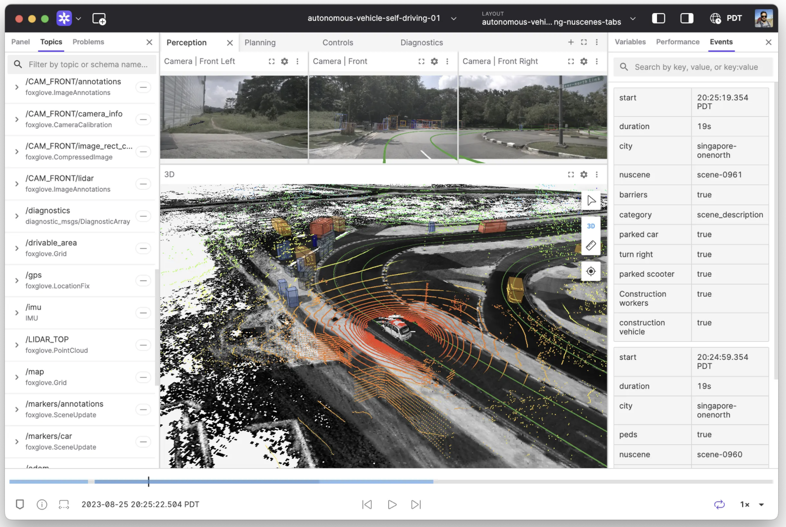
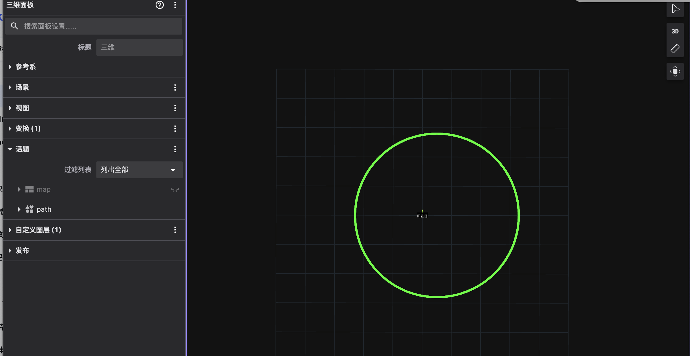
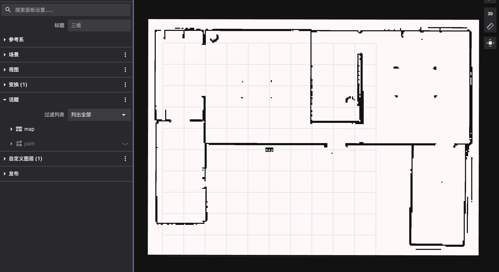
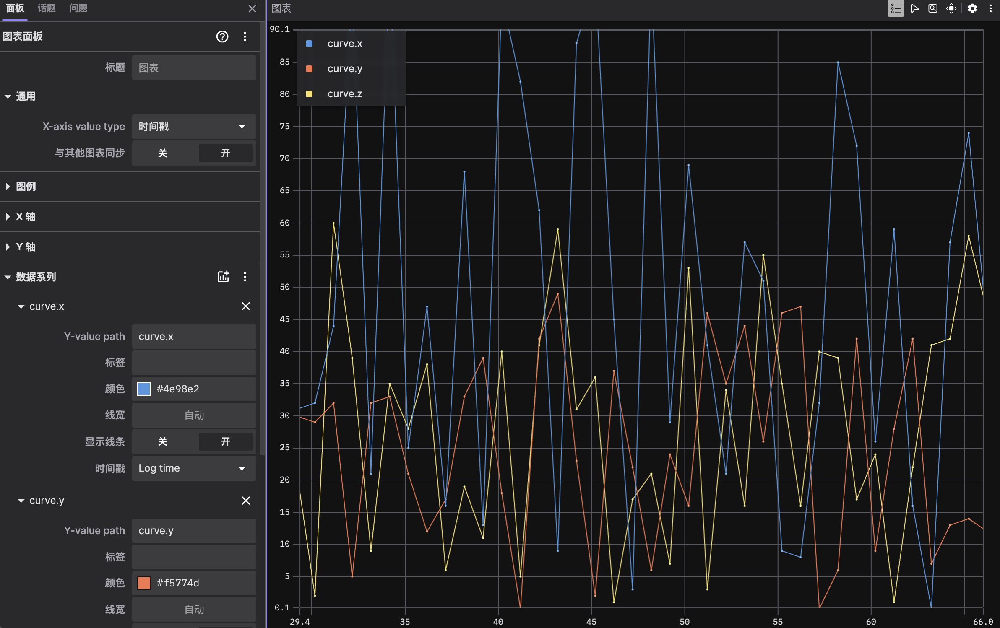

# 12 可视化

## 1 介绍

Foxglove 是一款专为机器人领域设计的强大开源数据可视化与调试工具。它通过提供直观的可视化界面和丰富的功能，帮助开发者、研究人员更高效地理解、分析和调试机器人系统的复杂数据。

下面这个表格汇总了 Foxglove 的一些核心功能与特点，方便你快速了解：

| 功能类别           | 核心能力                                                     | 备注/示例                                              |
| :----------------- | :----------------------------------------------------------- | :----------------------------------------------------- |
| **🤖 数据支持**     | 支持 ROS 1、ROS 2、MCAP 等多种数据格式和协议                 | 可连接实时系统或回放记录的 bag 文件、MCAP 文件等。     |
| **🖥️ 多模态可视化** | 提供 3D 视图、激光雷达点云、图像视频、图表绘制、日志查看等多种可视化面板 | 允许用户自定义面板布局，满足特定调试需求。             |
| **🔧 调试与诊断**   | 查看诊断信息、参数管理、话题发布、远程操作（Teleop）等功能   | 支持在工具内直接修改参数或发布指令，与机器人系统交互。 |
| **🌐 协作与共享**   | 支持布局保存和共享，方便团队协作                             | 统一的视图配置有助于保持团队分析的一致性。             |
| **⚙️ 部署与扩展**   | 提供桌面客户端、Web 端以及自托管选项                         | 支持使用 JavaScript 开发自定义面板，扩展性强。         |

Foxglove 的核心优势在于它能将机器人系统中各种**不同类型的数据（多模态数据）** 在**统一的界面**中进行可视化关联分析：

- **3D 可视化**：在**3D 视图**中，你、可以同时显示机器人的**运动轨迹**、**传感器数据（如激光雷达点云、深度图像）**和**环境信息（如地图、障碍物）**。这对于**感知算法验证**、**导航调试**和**整体系统行为理解**至关重要。
- **时间序列数据绘图**：**Plot 面板**可以绘制任何数值型数据随时间变化的曲线，非常适合分析**传感器读数**、**控制指令**、**状态估计**等数据的变化趋势和相互关系。
- **图像与视频流查看**：**Image 面板**能够实时显示机器人摄像头采集的**图像或视频流**，用于**视觉算法**的调试和监控。
- **日志与原始消息**：**Log 面板**和**Raw Messages 面板**让你可以查看系统的**日志输出**和**原始消息内容**，便于进行**细节排查**和**数据解析**

## 2 如何使用？

* **下载** ：[foxglove studio](https://foxglove.dev/download)。你可以从官网下载 **桌面客户端**（支持 Windows, macOS, Linux），或直接在现代浏览器中访问 **Web 版本**。
* **连接数据源**：
  - 对于**实时数据**，通常需要在机器人系统上运行 **foxglove_bridge** 或 **rosbridge_server**，然后在 Foxglove 中选择对应的 WebSocket 连接方式并输入地址。
  - 对于**离线数据**，直接将本地的 bag 文件或 MCAP 文件**拖拽**到 Foxglove 界面中即可打开。
* **配置布局**：根据你的调试需求，从左侧添加所需的**可视化面板**（如 3D、Plot、Image、Log 等），并订阅相应的话题或数据字段。
* **分析与调试**：利用时间轴控制播放，观察不同面板中的数据关联，从而发现问题或验证算法。



## 3 支持的数据类型

* commsgs::sensor_msgs::Image

* commsgs::sensor_msgs::CameraInfo
* commsgs::sensor_msgs::CompressedImage
* commsgs::sensor_msgs::LaserScan
* commsgs::sensor_msgs::Imu
* commsgs::sensor_msgs::PointCloud
* commsgs::sensor_msgs::PointCloud2
* commsgs::sensor_msgs::PointCloud
* commsgs::sensor_msgs::Range
* commsgs::geometry_msgs::Point
* commsgs::geometry_msgs::PointStamped
* commsgs::geometry_msgs::Polygon
* commsgs::geometry_msgs::PolygonStamped
* commsgs::geometry_msgs::Pose2D
* commsgs::geometry_msgs::Pose
* commsgs::geometry_msgs::PoseArray
* commsgs::geometry_msgs::PoseStamped
* commsgs::geometry_msgs::Transform
* commsgs::geometry_msgs::TransformStamped
* commsgs::geometry_msgs::TransformStampeds
* commsgs::map_msgs::OccupancyGrid
* commsgs::map_msgs::OccupancyGridUpdate
* commsgs::map_msgs::Octomap
* commsgs::map_msgs::GridMap
* commsgs::planning_msgs::Path
* commsgs::planning_msgs::Odometry
* commsgs::vision_msgs::BoundingBox2D
* commsgs::vision_msgs::BoundingBox2DArray
* commsgs::vision_msgs::Point2D
* commsgs::vision_msgs::Pose2D
* commsgs::vision_msgs::BoundingBox3D
* commsgs::vision_msgs::BoundingBox3DArray
* commsgs::vision_msgs::ObjectHypothesis
* commsgs::vision_msgs::Classification
* commsgs::vision_msgs::ObjectHypothesisWithPose
* commsgs::vision_msgs::Detection2D
* commsgs::vision_msgs::Detection2DArray
* commsgs::vision_msgs::Detection2D
* commsgs::vision_msgs::Detection3D
* commsgs::vision_msgs::Detection3DArray
* commsgs::vision_msgs::LabelInfo

## 4 Examples

| 序号 |   功能   |                            可视化                            |
| :--: | :------: | :----------------------------------------------------------: |
|  1   | 显示路径 |  |
|  2   | 显示地图 |   |
|  3   | 实时曲线 |  |

* 创建服务器

```C++
#include "autonomy/visualization/visualization_server.hpp"

VisualizationServer::SharedPtr GetServer()
{
    proto::VisualizationOptions options;
    options.set_host("0.0.0.0");
    options.set_port(8765);
    options.set_mcap_filename("");
    options.set_write_mcap_data(false);
    return std::make_shared<VisualizationServer>(options);
}
```

* 显示路径

```c++
commsgs::planning_msgs::Path CreatePathMsgs()
{
    commsgs::planning_msgs::Path msgs;
    msgs.header.frame_id = "map";

    const float CENTER_X = 0.5f;
    const float CENTER_Y = 0.0f;
    const float RADIUS = 2.8f;
    const int NUM_POINTS = 100;
    for (int i = 0; i < NUM_POINTS; ++i) {

        commsgs::geometry_msgs::PoseStamped pose;
        float angle = 2.0f * M_PI * i / NUM_POINTS;
        pose.pose.position.x = CENTER_X + RADIUS * cos(angle);
        pose.pose.position.y = CENTER_Y + RADIUS * sin(angle);
        pose.pose.position.z = 0.0;
        msgs.poses.push_back(pose);
    }
    return msgs;
}

server->Publish<commsgs::planning_msgs::Path>("path", std::move(path));
std::this_thread::sleep_for(std::chrono::seconds(1));
```

* 显示地图

```c++
commsgs::map_msgs::OccupancyGrid CreateMapMsgs()
{
    std::string yaml_file = "/workspace/autonomy/configuration_files/map/turtlebot3_house.yaml";
    LOG(INFO) << "map_file: " << yaml_file;

    commsgs::map_msgs::OccupancyGrid map_data;
    if (map::costmap_2d::loadMapFromYaml(yaml_file, map_data) != map::costmap_2d::LOAD_MAP_STATUS::LOAD_MAP_SUCCESS) {
        LOG(ERROR) << "Load yaml file error.";
        return map_data;
    }

    return map_data;
}

server->Publish<commsgs::planning_msgs::Path>("path", std::move(map));
std::this_thread::sleep_for(std::chrono::seconds(1));
```

* 显示曲线

```C++
commsgs::geometry_msgs::Point CreatePointMsgs()
{
    commsgs::geometry_msgs::Point msgs;
    msgs.x = autonomy::common::math::RandomUniformInteger(0, 100);
    msgs.y = autonomy::common::math::RandomUniformInteger(0, 50);
    msgs.z = autonomy::common::math::RandomUniformInteger(0, 60);
    return msgs;
}

auto point = CreatePointMsgs();
server->Publish<commsgs::geometry_msgs::Point>("curve", std::move(point));
```

