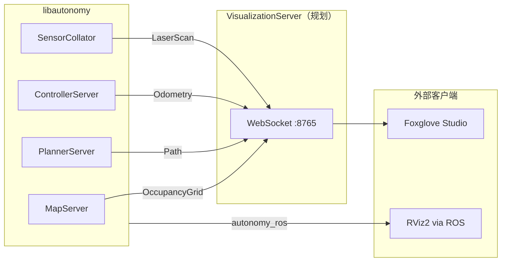

# 5. 架构设计

### 5.1 目标架构（规划）



`VisualizationServer` 设计职责：

1. 订阅 Autolink topic（或注册栈内回调）
2. 将 commsgs 序列化转发到 Foxglove WebSocket
3. 可选 MCAP 录制（`install_mcap.sh` 已提供依赖，C++ 未集成）

### 5.2 当前架构（已实现）

```
MapServer::PublishMap()
  → MapPublishCallback（Autonomy 注册）
    → ApplyMapToCostmap()
    → map_listeners_ 回调

PlannerServer::GetPlan()
  → 返回 Path（进程内 API，无 Writer）

Costmap2DWrapper::publishMap()
  → snapshotOccupancyGrid()（内存快照，不发布到 channel）

SensorCollator → feedLaserScan() → ObstacleLayer
```

**关键事实**：各 Server 以 **C++ API + 回调** 为主，**无**统一的 Autolink Writer 将数据推到可视化 topic。

### 5.3 地图与 RViz 兼容性

`autonomy/map/costmap_2d/costmap_2d_wrapper.cpp` 在生成 `OccupancyGrid` 时，将 `INSCRIBED_INFLATED_OBSTACLE` 映射为 occupancy 值 `99`，与 Nav2 / RViz 调色板习惯一致。

`Costmap2DPublisher`（`costmap_2d_publisher.hpp`）保留 Nav2 风格接口，ROS 发布代码已注释，未接 Autolink。

### 5.4 与 Bridge 的边界

| 模块 | 协议 | 用途 |
|------|------|------|
| `autonomy/bridge` | gRPC / MQTT | 远程导航、探索 |
| `foxglove_bridge`（ROS 包） | WebSocket + ROS 2 | Foxglove 可视化 |
| `VisualizationServer`（规划） | WebSocket + commsgs | 原生可视化 |

三者**互不替代**。详见 [15 Bridge](../15_Bridge/00_guide.md)。

### 5.5 各模块数据出口

| 模块 | 可视化相关输出 | 当前方式 |
|------|----------------|----------|
| Map | OccupancyGrid | 回调 → costmap |
| Planning | Path | `GetPlan()` 返回值 |
| Control | cmd_vel, odom | ControllerServer 内部 |
| Localization | pose, odom | 配置 topic 名（ROS 侧） |
| Perception | Detection2DArray | 规划订阅（文档） |

### 5.6 相关文档

- [§6 Foxglove](06_foxglove.md)
- [07 Map · 架构](../07_Map/01_architecture.md)
- [08 Planning · 架构](../08_Planning/01_architecture.md)
