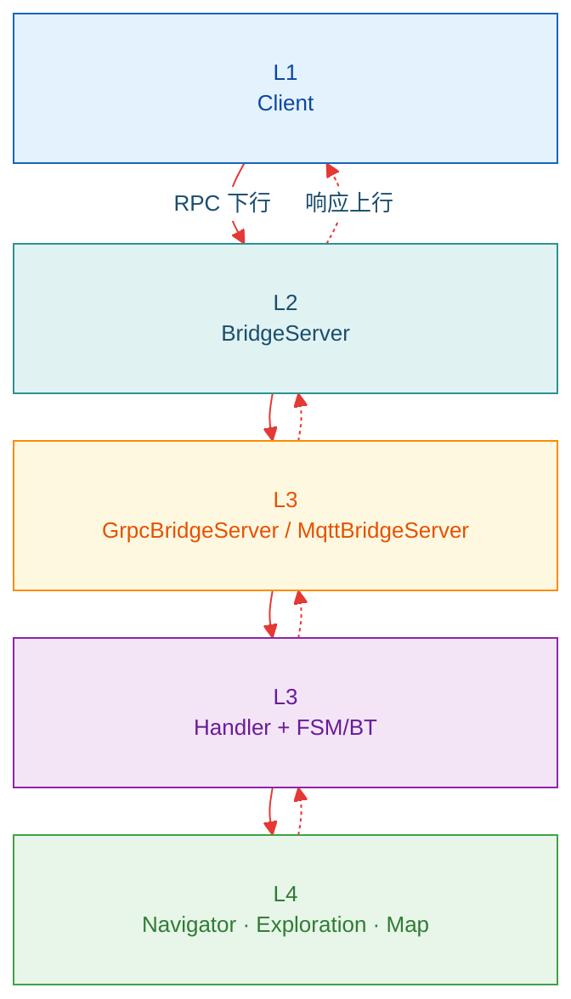

(bridge-architecture)=
# 2. 架构设计

> **`AutonomyService`** 数据流与 13 RPC 契约（`external_command_service.proto`）。上手 [§0](00_guide.md) · [§3 RPC](rpcs/index.rst)

  <strong>Bridge 在 Autonomy 栈中的位置</strong>
  Client → BridgeServer → GrpcBridgeServer / MqttBridge → 机载栈
  不参与规划控制 →

---

## 2.1 数据流

## 2.2 RPC Service

与 proto `service AutonomyService` 块顺序一致：

| 分类 | RPC | 请求 → 响应 | 模式 | 文档 |
|------|-----|-------------|------|------|
| Push | `ReceiveBotStates` | `Empty` → stream `RobotState` | Empty → Stream | [rpcs/05](rpcs/05_stream_api.md) |
| | `ReceiveBotEvents` | `Empty` → stream `RobotEvent` | Empty → Stream | [rpcs/05](rpcs/05_stream_api.md) |
| Query | `GetRobotSnapshot` | `Empty` → `RobotState` | Unary → Unary | [rpcs/04](rpcs/04_query_api.md) |
| | `GetActiveTask` | `Empty` → `ActiveTaskInfo` | Unary → Unary | [rpcs/04](rpcs/04_query_api.md) |
| | `GetCapabilities` | `Empty` → `Capabilities` | Unary → Unary | [rpcs/04](rpcs/04_query_api.md) |
| System | `EmergencyStop` | `EmergencyStopRequest` → `CommandAck` | Unary → Unary | [rpcs/06](rpcs/06_system_api.md) |
| | `CancelAllTasks` | `CancelAllTasksRequest` → `CommandAck` | Unary → Unary | [rpcs/06](rpcs/06_system_api.md) |
| Command | `SendNavigationCommand` | `NavigationCommandRequest` → stream `NavigationCommandResponse` | Unary → Stream | [rpcs/07](rpcs/07_navigation_command.md) |
| | `SendFollowCommand` | `FollowCommandRequest` → stream `FollowCommandResponse` | Unary → Stream | [rpcs/09](rpcs/09_follow_command.md) |
| | `SendTeleopCommand` | stream `TeleopCommandRequest` → stream `TeleopCommandResponse` | Stream ↔ Stream | [rpcs/10](rpcs/10_teleop_command.md) |
| | `SendExplorationCommand` | `ExplorationCommandRequest` → stream `ExplorationCommandResponse` | Unary → Stream | [rpcs/08](rpcs/08_exploration_command.md) |
| | `SendDockCommand` | `DockCommandRequest` → stream `DockCommandResponse` | Unary → Stream | [rpcs/11](rpcs/11_dock_command.md) |
| | `SendMapCommand` | `MapCommandRequest` → stream `MapCommandResponse` | Unary → Stream | [rpcs/12](rpcs/12_map_command.md) |

---

**导航**：[← §0 指南](00_guide.md) · [rpcs/ API →](rpcs/index.rst)
