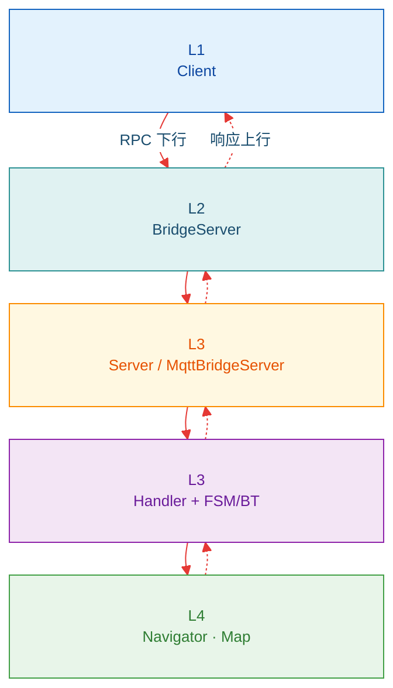

(bridge-architecture)=
# 2. 架构设计

> **`automsgs.rpcs.*`** 域服务数据流。上手 [§0](00_guide.md) · [§3 RPC](rpcs/index.rst)

<div class="nav-costmap-banner">
  <strong>Bridge 在 Autonomy 栈中的位置</strong>
  <span class="nav-costmap-detail">Client → BridgeServer → Server / MqttBridge → 机载栈</span>
  <span class="nav-costmap-arrow">不参与规划控制 →</span>
</div>

---

## 2.1 数据流

<div class="nav-state-diagram bridge-arch-flow">



</div>

## 2.2 gRPC 进程内四层

机载实现（`autonomy/bridge/grpc/`）固定分层；权威短文见源码旁 `autonomy/bridge/grpc/DESIGN.md`（与本手册交叉引用：[§4.1](04_grpc.md)）。

```text
Handler  →  Context / DomainBundle  →  Stub  →  Channel | Action | Cache
 薄            所有权 · Cancel · infra         域语义              机制
```

| 层 | 做什么 | 不做什么 |
|----|--------|----------|
| **Handler** | gRPC 进出、`BRIDGE_*` 宏 | 写 topic、持有业务状态 |
| **Context / DomainBundle** | Muxer · Hub · Pool · Stub · CancelAll | RPC 字段解析 |
| **Stub** | 域命令、互斥、session、组帧 | 直接碰 `async_grpc` 类型 |
| **机制** | GoalChannel / Action CRTP / SampleCache / ProtoPool | 某一 RPC 的特例分支 |

复用栈内设施：`ThreadPool`（WorkScheduler）、`ObjectPool`（ProtoPool）、`Factory`（CancelRegistry）、`function_traits`（DispatchCommands）。

## 2.3 RPC Service

对外仅 `automsgs.rpcs.*` 域服务（详见 [rpcs/02](rpcs/02_service_overview.md)）：

| 分类 | 服务 / RPC | 模式 | 文档 |
|------|------------|------|------|
| Command | `NavigationService` · `FollowService` · `TeleopService` · `ChargeService` · `ExplorationService` · `VoiceService` | Unary→Stream / Bidi | [rpcs/07+](rpcs/07_navigation_command.md) |
| Map | `MapService` | Unary（建图 + 资源） | [rpcs/12](rpcs/12_map_command.md) |
| Query | `LocalizationService` · `SensorService` · `SystemService`（Info / Health / FullInfo / Capabilities / ActiveGoal） | Unary | [rpcs/04](rpcs/04_query_api.md) |
| System | `EmergencyStop` · `ClearEmergencyStop` · `CancelAllGoals` | Unary | [rpcs/06](rpcs/06_system_api.md) |

---

**导航**：[← §0 指南](00_guide.md) · [rpcs/ API →](rpcs/index.rst)
