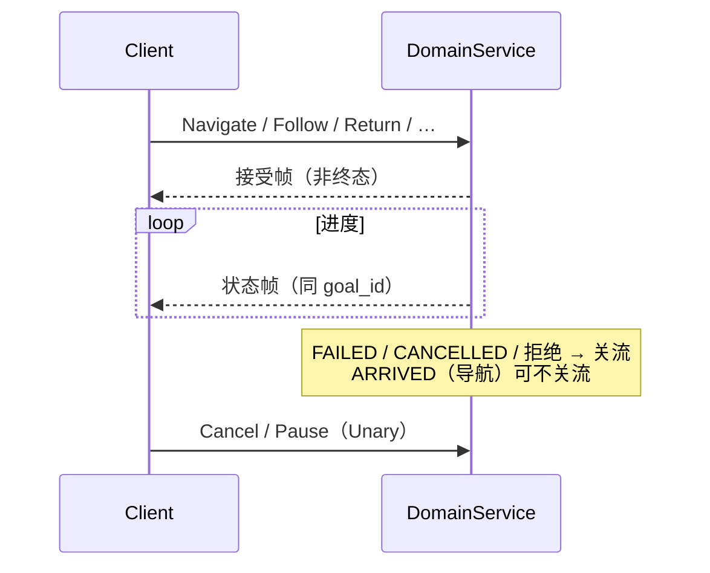

(rpc-common-types)=
# 公共消息类型

定义于 `automsgs/proto/rpcs/common.proto`；域服务响应与生命周期 RPC 共用。

## 3.1 Status

```protobuf
message Status {
  automsgs.msgs.status_msgs.StatusCode code = 1;
  string message = 2;
}
```

| 字段 | 含义 |
|------|------|
| `code` | 统一 `StatusCode`（成功=`OK`） |
| `message` | 可读说明 |

命令流帧通常含 `Status` + 域状态枚举（如 `NavigationState`），**不再**使用旧 `CommandAck.final`；关流条件见各域 proto 注释。

## 3.2 GoalRequest / GetStatusRequest

多数域的 `Pause` / `Resume` / `Cancel` 共用：

```protobuf
message GoalRequest { string goal_id = 1; }  // 空 = 当前目标
```

`GetStatusRequest` 多为空消息；响应与对应命令流帧同形。

## 3.3 TaskType（Muxer）

Bridge `TaskMuxer` 使用 `vehicle_msgs` 任务类型（见 `grpc/task_types.hpp`）：

| 值 | 枚举 | 服务 |
|----|------|------|
| 1 | `TASK_TYPE_NAVIGATION` | `NavigationService` |
| 2 | `TASK_TYPE_FOLLOW` | `FollowService` |
| 3 | `TASK_TYPE_TELEOP` | `TeleopService` |
| 4 | `TASK_TYPE_EXPLORATION` | `ExplorationService` |
| 5 | `TASK_TYPE_DOCK` | `ChargeService` |
| 6 | `TASK_TYPE_MAP` | `MapService` |

## 3.4 命令流时序（通用）



细节以各域 proto 为准。
