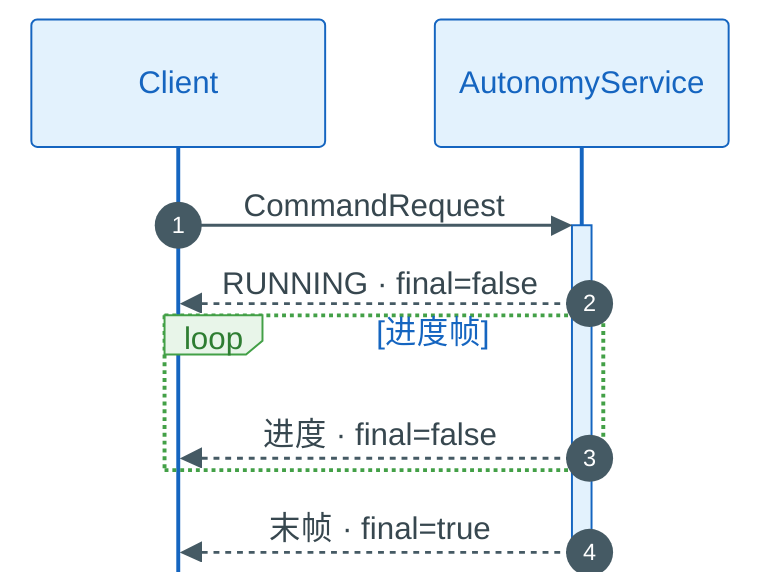

(rpc-common-types)=
# 公共消息类型

定义于 `external_command_service.proto`，Command / System / Stream 共用。

## 3.1 RequestHeader

所有 Command / System 请求的**第一个字段**：

```protobuf
message RequestHeader {
  commsgs.proto.builtin_interfaces.Time timestamp = 1;
  string cmd_id = 2;      // 必填，UUID，Stream 响应关联键
  string client_id = 3;
  string nonce = 4;
}
```

| 字段 | 测试建议 |
|------|----------|
| `cmd_id` | 每次新命令换新 UUID；同一 Stream 内不变 |
| `timestamp` | 生产环境建议填；防重放依赖 `nonce` |
| `client_id` | 填调用方名称，便于日志 |

## 3.2 CommandAck

Command Stream 响应与 System Unary 响应的**第一个字段**：

```protobuf
message CommandAck {
  bool success = 1;
  string message = 2;
  commsgs.proto.error_code.ErrorCode error_code = 3;
  bool final = 4;           // true = 本条为 Stream 最后一帧
  string cmd_id = 5;
  TaskType task_type = 6;
  TaskStatus task_status = 7;
}
```

| 字段 | 含义 |
|------|------|
| `final` | `false` = 进度帧；`true` = 任务结束，可关闭 Stream |
| `success` | 本条是否成功（末帧失败时也为 `false`） |
| `error_code` | 结构化错误，见 §3.6 |

## 3.3 TaskType / TaskStatus

**TaskType**（Command 枚举 · JSON 用整型）

| 值 | 枚举 | RPC |
|----|------|-----|
| 1 | `TASK_TYPE_NAVIGATION` | `SendNavigationCommand` |
| 2 | `TASK_TYPE_FOLLOW` | `SendFollowCommand` |
| 3 | `TASK_TYPE_TELEOP` | `SendTeleopCommand` |
| 4 | `TASK_TYPE_EXPLORATION` | `SendExplorationCommand` |
| 5 | `TASK_TYPE_DOCK` | `SendDockCommand` |
| 6 | `TASK_TYPE_MAP` | `SendMapCommand` |

与 `vehicle_msgs.RobotTaskType` 数值相同（[05 §5.3](05_stream_api.md#53-vehicle_msgs)）。

**TaskStatus**：`IDLE`(1) · `RUNNING`(2) · `PAUSED`(3) · `SUCCEEDED`(4) · `FAILED`(5) · `CANCELED`(6)。

## 3.4 NavigationPluginOptions

`SendNavigationCommand` 可选字段 `plugins`：

| 字段 | 说明 |
|------|------|
| `planner_id` | 全局规划器 ID（来自 `GetCapabilities.planner_ids`） |
| `controller_id` | 局部控制器 ID |
| `goal_checker_id` | 目标检查器 ID |
| `behavior_tree` | BT XML 路径 |

## 3.5 Command Stream 时序

<div class="rpc-flow-diagram rpc-flow-diagram--seq">



</div>

System Unary（`EmergencyStop`）只返回一帧 `CommandAck`，无 `final` 字段语义。

## 3.6 错误码

`CommandAck.error_code` → `autonomy.commsgs.proto.error_code.ErrorCode`（全量：[Commsgs §8.3](../../14_Commsgs/08_nav_planning_msgs.md#83-error_code)）。

| 常见值 | 含义 |
|--------|------|
| `OK` (0) | 成功 |
| `PLANNING_NO_PATH_FOUND` | 无路径 |
| `CONTROL_ROBOT_STUCK` | 机器人卡住 |
| `LOCALIZATION_TF_ERROR` | TF 不可用 |

**gRPC 层**（未收到合法 Stream 末帧时）

| 状态码 | 原因 |
|--------|------|
| `INVALID_ARGUMENT` | 缺 `header`、枚举值非法 |
| `FAILED_PRECONDITION` | 已有活跃任务 |
| `UNAVAILABLE` | 机载栈未就绪 |
