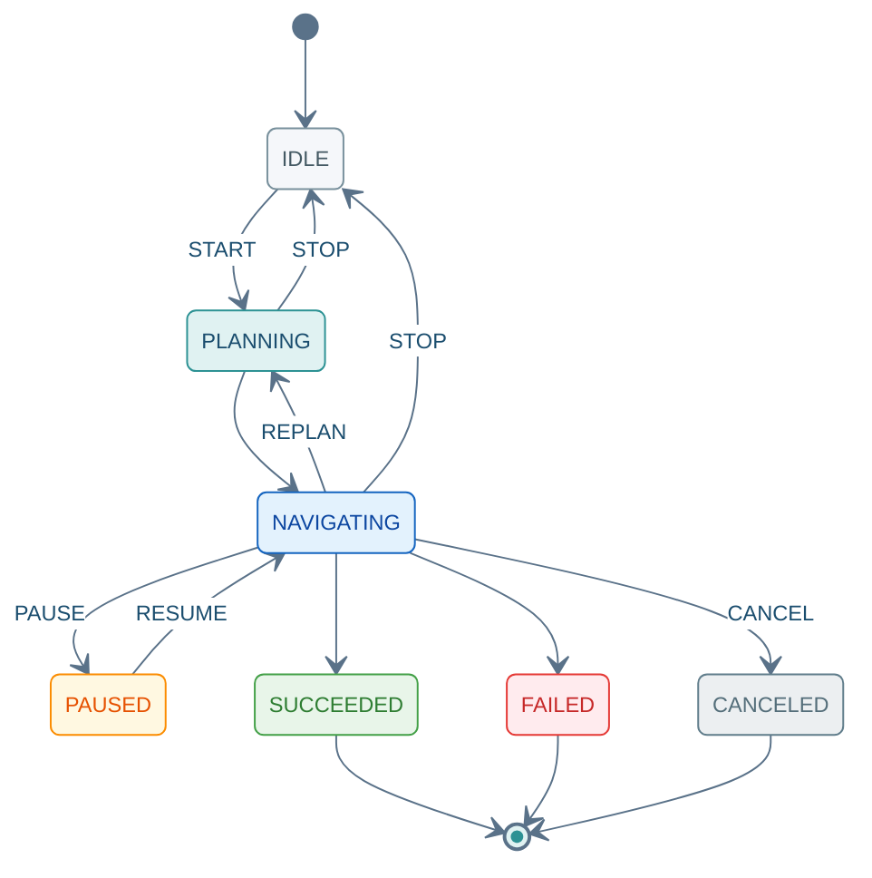

(rpc-navigation-command)=
# SendNavigationCommand

Unary 请求 → Server Stream 响应。`START` 前请先 [GetCapabilities](04_query_api.md) / [GetActiveTask](04_query_api.md)；Stream 以末帧 `ack.final=true` 结束。

---

## 7.1 方法签名

```protobuf
rpc SendNavigationCommand(NavigationCommandRequest)
    returns (stream NavigationCommandResponse);
```

---

## 7.2 Proto 定义

源文件：`autonomy/bridge/proto/external_command_service.proto`

```protobuf
enum NavigationMode {
  NAV_MODE_UNSPECIFIED = 0;
  NAV_MODE_SINGLE_POSE = 1;      // NavigateToPose
  NAV_MODE_THROUGH_POSES = 2;    // NavigateThroughPoses，按序巡航
}

enum NavigationCommand {
  NAV_CMD_UNSPECIFIED = 0;
  NAV_CMD_START = 1;
  NAV_CMD_STOP = 2;
  NAV_CMD_CANCEL = 3;
  NAV_CMD_RESUME = 4;
  NAV_CMD_PAUSE = 5;
  NAV_CMD_REPLAN = 6;            // 保持目标不变，重新规划路径
}

enum NavigationStatus {
  NAV_STATUS_UNKNOWN = 0;
  NAV_STATUS_IDLE = 1;
  NAV_STATUS_PLANNING = 2;
  NAV_STATUS_NAVIGATING = 3;
  NAV_STATUS_PAUSED = 4;
  NAV_STATUS_SUCCEEDED = 5;
  NAV_STATUS_FAILED = 6;
  NAV_STATUS_CANCELED = 7;
}

message NavigationCommandRequest {
  RequestHeader header = 1;
  NavigationCommand command = 2;
  NavigationMode mode = 3;         // START 时必填
  repeated commsgs.proto.geometry_msgs.PoseStamped goals = 4;  // START 时必填
  NavigationPluginOptions plugins = 5;
  float timeout_sec = 6;           // 0 = 服务端默认
}

message NavigationCommandResponse {
  CommandAck ack = 1;
  NavigationStatus status = 2;
  int32 current_waypoint_index = 3;
  int32 total_waypoints = 4;
  float distance_remaining = 5;
  commsgs.proto.geometry_msgs.PoseStamped current_pose = 6;
}
```

---

## 7.3 字段说明

### Request · `NavigationCommandRequest`

| 字段 | 类型 | 必填 | 说明 |
|------|------|:----:|------|
| `header` | `RequestHeader` | ✓ | [03 §3.1](03_common_types.md#31-requestheader) |
| `command` | `NavigationCommand` | ✓ | 子命令；见下表 |
| `mode` | `NavigationMode` | START | `1` 单点 · `2` 顺序多点 |
| `goals` | `PoseStamped[]` | START | `header.frame_id` 通常 `"map"` |
| `plugins` | `NavigationPluginOptions` | — | [03 §3.4](03_common_types.md#34-navigationpluginoptions) |
| `timeout_sec` | `float` | — | 秒；`0` = 服务端默认 |

**`NavigationCommand` 枚举**

| 值 | 常量 | 说明 |
|:--:|------|------|
| 1 | `NAV_CMD_START` | 开始；需 `mode` + `goals` |
| 2 | `NAV_CMD_STOP` | 停止；幂等 → `IDLE` |
| 3 | `NAV_CMD_CANCEL` | 取消任务 |
| 4 | `NAV_CMD_RESUME` | 从 `PAUSED` 恢复 |
| 5 | `NAV_CMD_PAUSE` | 暂停 |
| 6 | `NAV_CMD_REPLAN` | 保持 `goals`，重新规划 |

### Response · `NavigationCommandResponse`

| 字段 | 类型 | 说明 |
|------|------|------|
| `ack` | `CommandAck` | 流应答；末帧 `final=true` · [03 §3.2](03_common_types.md#32-commandack) |
| `status` | `NavigationStatus` | 导航阶段 |
| `current_waypoint_index` | `int32` | 当前航点（多点） |
| `total_waypoints` | `int32` | 航点总数 |
| `distance_remaining` | `float` | 剩余距离 (m) |
| `current_pose` | `PoseStamped` | 当前位姿 |

**`NavigationStatus`**：`IDLE`(1) · `PLANNING`(2) · `NAVIGATING`(3) · `PAUSED`(4) · `SUCCEEDED`(5) · `FAILED`(6) · `CANCELED`(7)

<div class="nav-state-diagram">



</div>

---

## 7.4 示例（grpcurl）

**环境**：[01 §1.1](01_connection_guide.md#11-环境配置) · **TC 全集**：[13 §13.6](13_integration_tests.md#136-sendnavigationcommand-测试用例) · **JSON 参考**：[01 §1.4](01_connection_guide.md#14-响应-json-参考)

每张卡片上方 **发送指令**（蓝）、下方 **收到结果**（绿）；Stream 响应以末帧 `ack.final=true` 为准。

### 7.4.1 示例索引

| 编号 | 在干什么 | `command` | 末帧预期 | TC |
|:----:|----------|:---------:|----------|-----|
| [NAV-01](#nav-01) | 确认可导航、无残留任务 | — | 可导航 · 无活跃任务 | — |
| [NAV-02](#nav-02) | 单点导航到目标 | 1 | 到达 · SUCCEEDED | `TC-NAV-001` |
| [NAV-03](#nav-03) | 3 航点顺序巡航 | 1 | 航点索引 0→2 · SUCCEEDED | `TC-NAV-002` |
| [NAV-04](#nav-04) | 暂停导航 | 5 | PAUSED | `TC-NAV-003` |
| [NAV-05](#nav-05) | 暂停后恢复 | 4 | 恢复行驶 → SUCCEEDED | `TC-NAV-003` |
| [NAV-06](#nav-06) | 保持目标重规划 | 6 | 重规划后继续 | `TC-NAV-006` |
| [NAV-07](#nav-07) | 取消任务 | 3 | CANCELED | `TC-NAV-005` |
| [NAV-08](#nav-08) | 停止并回空闲 | 2 | IDLE | `TC-NAV-004` |
| [NAV-09](#nav-09) | 双终端联调冒烟 | — | 见步骤表 | E2E-001 / 002 |

---

(nav-01)=
### 7.4.2 NAV-01 · 前置检查

发 `START` 前确认：Bridge 支持导航，且当前无进行中的任务。

<div class="nav-card nav-card-single">

<div class="nav-card-meta">
<span class="nav-chip">GetCapabilities + GetActiveTask</span>
<span class="nav-chip nav-chip-out">可导航 · 无活跃任务</span>
</div>

<div class="nav-demo-grid">

<details class="nav-demo-panel nav-send">
<summary>发送指令</summary>

```bash
# NAV-01 · GetCapabilities + GetActiveTask
grpcurl -plaintext $PROTO_OPTS -d '{}' $BRIDGE $SVC/GetCapabilities
grpcurl -plaintext $PROTO_OPTS -d '{}' $BRIDGE $SVC/GetActiveTask
```

</details>

<details class="nav-demo-panel nav-recv">
<summary>收到结果</summary>

```json
{ "supportsNavigation": true }
{ "type": "TASK_TYPE_NONE" }
```

</details>

</div>
</div>

---

### 7.4.3 启动

(nav-02)=
#### 7.4.3.1 NAV-02 · START 单点

向单一目标点发起导航：规划 → 行驶 → 到达，Stream 末帧 `SUCCEEDED`。

<div class="nav-card">

<div class="nav-card-meta">
<span class="nav-chip">command <b>1</b> · mode <b>1</b></span>
<span class="nav-chip nav-chip-out">到达目标点</span>
</div>

<div class="nav-demo-grid">

<details class="nav-demo-panel nav-send">
<summary>发送指令</summary>

```bash
# NAV-02 · START(1) mode=1 · 单目标点
export CMD_ID=$(new_cmd_id)

grpcurl -plaintext $PROTO_OPTS \
  -d @- \
  $BRIDGE \
  $SVC/SendNavigationCommand <<EOF
{
  "header": {
    "cmd_id": "${CMD_ID}",
    "client_id": "demo"
  },
  "command": 1,
  "mode": 1,
  "goals": [
    {
      "header": { "frame_id": "map" },
      "pose": {
        "position": { "x": 1.0, "y": 2.0, "z": 0.0 },
        "orientation": { "w": 1.0 }
      }
    }
  ],
  "plugins": {
    "planner_id": "navfn_planner",
    "controller_id": "graceful_controller"
  },
  "timeout_sec": 300
}
EOF
```

</details>

<details class="nav-demo-panel nav-recv">
<summary>收到结果 · 末帧</summary>

```json
{
  "ack": {
    "success": true,
    "final": true,
    "taskStatus": "TASK_STATUS_SUCCEEDED"
  },
  "status": "NAV_STATUS_SUCCEEDED",
  "distanceRemaining": 0.0
}
```

</details>

</div>
</div>

(nav-03)=
#### 7.4.3.2 NAV-03 · START 多点

按顺序经过 3 个航点（`mode=2`）；Stream 中 `currentWaypointIndex` 应从 0 增至 2。

<div class="nav-card">

<div class="nav-card-meta">
<span class="nav-chip">command <b>1</b> · mode <b>2</b></span>
<span class="nav-chip nav-chip-out">3 航点依次到达</span>
</div>

<div class="nav-demo-grid">

<details class="nav-demo-panel nav-send">
<summary>发送指令</summary>

```bash
# NAV-03 · START(1) mode=2 · 3 航点
export CMD_ID=$(new_cmd_id)

grpcurl -plaintext $PROTO_OPTS \
  -d @- \
  $BRIDGE \
  $SVC/SendNavigationCommand <<EOF
{
  "header": { "cmd_id": "${CMD_ID}" },
  "command": 1,
  "mode": 2,
  "goals": [
    {
      "header": { "frame_id": "map" },
      "pose": { "position": { "x": 1.0, "y": 1.0 } }
    },
    {
      "header": { "frame_id": "map" },
      "pose": { "position": { "x": 3.0, "y": 1.0 } }
    },
    {
      "header": { "frame_id": "map" },
      "pose": { "position": { "x": 3.0, "y": 3.0 } }
    }
  ]
}
EOF
```

</details>

<details class="nav-demo-panel nav-recv">
<summary>收到结果 · 流中帧 + 末帧</summary>

```json
{ "status": "NAV_STATUS_PLANNING", "totalWaypoints": 3, "currentWaypointIndex": 0 }
{ "status": "NAV_STATUS_NAVIGATING", "currentWaypointIndex": 1, "distanceRemaining": 1.4 }
{
  "ack": { "success": true, "final": true, "taskStatus": "TASK_STATUS_SUCCEEDED" },
  "status": "NAV_STATUS_SUCCEEDED",
  "currentWaypointIndex": 2,
  "totalWaypoints": 3,
  "distanceRemaining": 0.0
}
```

</details>

</div>
</div>

---

### 7.4.4 运行控制

(nav-04)=
#### 7.4.4.1 NAV-04 · PAUSE

暂停正在进行的导航（机器人停住，任务保持 `PAUSED`）。

**前提**：[NAV-02/03](#nav-02) 已 START 且 Stream 未结束 · **另开终端**发送。

<div class="nav-card">

<div class="nav-card-meta">
<span class="nav-chip">command <b>5</b> PAUSE</span>
<span class="nav-chip nav-chip-out">导航已暂停</span>
</div>

<div class="nav-demo-grid">

<details class="nav-demo-panel nav-send">
<summary>发送指令</summary>

```bash
# NAV-04 · PAUSE(5)
export CMD_ID=$(new_cmd_id)

grpcurl -plaintext $PROTO_OPTS \
  -d @- \
  $BRIDGE \
  $SVC/SendNavigationCommand <<EOF
{
  "header": { "cmd_id": "${CMD_ID}" },
  "command": 5
}
EOF
```

</details>

<details class="nav-demo-panel nav-recv">
<summary>收到结果 · 末帧</summary>

```json
{
  "ack": {
    "success": true,
    "final": true,
    "taskStatus": "TASK_STATUS_PAUSED"
  },
  "status": "NAV_STATUS_PAUSED"
}
```

</details>

</div>
</div>

(nav-05)=
#### 7.4.4.2 NAV-05 · RESUME

从暂停恢复，继续向原目标行驶直至完成。

**前提**：紧接 [NAV-04](#nav-04) PAUSE 之后发送。

<div class="nav-card">

<div class="nav-card-meta">
<span class="nav-chip">command <b>4</b> RESUME</span>
<span class="nav-chip nav-chip-out">恢复行驶 → 到达</span>
</div>

<div class="nav-demo-grid">

<details class="nav-demo-panel nav-send">
<summary>发送指令</summary>

```bash
# NAV-05 · RESUME(4)
export CMD_ID=$(new_cmd_id)

grpcurl -plaintext $PROTO_OPTS \
  -d @- \
  $BRIDGE \
  $SVC/SendNavigationCommand <<EOF
{
  "header": { "cmd_id": "${CMD_ID}" },
  "command": 4
}
EOF
```

</details>

<details class="nav-demo-panel nav-recv">
<summary>收到结果 · 末帧</summary>

```json
{
  "ack": {
    "success": true,
    "final": true,
    "taskStatus": "TASK_STATUS_SUCCEEDED"
  },
  "status": "NAV_STATUS_SUCCEEDED"
}
```

</details>

</div>
</div>

(nav-06)=
#### 7.4.4.3 NAV-06 · REPLAN

目标点不变，重新规划路径（遇动态障碍时使用）。

**前提**：导航进行中（通常已 START）。

<div class="nav-card">

<div class="nav-card-meta">
<span class="nav-chip">command <b>6</b> REPLAN</span>
<span class="nav-chip nav-chip-out">重规划后继续行驶</span>
</div>

<div class="nav-demo-grid">

<details class="nav-demo-panel nav-send">
<summary>发送指令</summary>

```bash
# NAV-06 · REPLAN(6)
export CMD_ID=$(new_cmd_id)

grpcurl -plaintext $PROTO_OPTS \
  -d @- \
  $BRIDGE \
  $SVC/SendNavigationCommand <<EOF
{
  "header": { "cmd_id": "${CMD_ID}" },
  "command": 6
}
EOF
```

</details>

<details class="nav-demo-panel nav-recv">
<summary>收到结果 · 流中帧</summary>

```json
{ "status": "NAV_STATUS_PLANNING" }
{ "status": "NAV_STATUS_NAVIGATING", "ack": { "success": true, "final": false } }
```

</details>

</div>
</div>

---

### 7.4.5 结束

(nav-07)=
#### 7.4.5.1 NAV-07 · CANCEL

取消当前导航任务，释放任务槽，状态变为 `CANCELED`。

<div class="nav-card">

<div class="nav-card-meta">
<span class="nav-chip">command <b>3</b> CANCEL</span>
<span class="nav-chip nav-chip-out">任务已取消</span>
</div>

<div class="nav-demo-grid">

<details class="nav-demo-panel nav-send">
<summary>发送指令</summary>

```bash
# NAV-07 · CANCEL(3)
export CMD_ID=$(new_cmd_id)

grpcurl -plaintext $PROTO_OPTS \
  -d @- \
  $BRIDGE \
  $SVC/SendNavigationCommand <<EOF
{
  "header": { "cmd_id": "${CMD_ID}" },
  "command": 3
}
EOF
```

</details>

<details class="nav-demo-panel nav-recv">
<summary>收到结果 · 末帧</summary>

```json
{
  "ack": {
    "success": true,
    "final": true,
    "taskStatus": "TASK_STATUS_CANCELED"
  },
  "status": "NAV_STATUS_CANCELED"
}
```

</details>

</div>
</div>

(nav-08)=
#### 7.4.5.2 NAV-08 · STOP

停止导航并回到 `IDLE`；联调收尾常用，无活跃任务时调用亦有效（幂等）。

<div class="nav-card">

<div class="nav-card-meta">
<span class="nav-chip">command <b>2</b> STOP</span>
<span class="nav-chip nav-chip-out">回到空闲</span>
</div>

<div class="nav-demo-grid">

<details class="nav-demo-panel nav-send">
<summary>发送指令</summary>

```bash
# NAV-08 · STOP(2)
export CMD_ID=$(new_cmd_id)

grpcurl -plaintext $PROTO_OPTS \
  -d @- \
  $BRIDGE \
  $SVC/SendNavigationCommand <<EOF
{
  "header": { "cmd_id": "${CMD_ID}" },
  "command": 2
}
EOF
```

</details>

<details class="nav-demo-panel nav-recv">
<summary>收到结果 · 末帧</summary>

```json
{
  "ack": {
    "success": true,
    "final": true,
    "taskStatus": "TASK_STATUS_IDLE"
  },
  "status": "NAV_STATUS_IDLE"
}
```

</details>

</div>
</div>

---

(nav-09)=
### 7.4.6 NAV-09 · 典型联调流程

双终端冒烟：**A** 看状态流 · **B** 清场 → 发导航 → 查活跃任务。各步 grpcurl 见下方卡片或对应 NAV 示例。

| 步骤 | 终端 | 在干什么 | 参考 |
|:----:|:----:|----------|------|
| 0 | B | 确认可导航、无残留任务 | [NAV-01](#nav-01) |
| 1 | A | 订阅机器人状态流 | 下方 · 终端 A |
| 2 | B | STOP 清场 | [NAV-08](#nav-08) |
| 3 | B | START 单点导航 | [NAV-02](#nav-02) |
| 4 | B | 确认任务类型为 NAVIGATION | 下方 · 终端 B |
| 可选 | B | 途中暂停再恢复 | [NAV-04](#nav-04) → [NAV-05](#nav-05) |

<div class="nav-card">

<div class="nav-card-meta">
<span class="nav-chip">终端 A · 步骤 1</span>
<span class="nav-chip nav-chip-out">持续收到 BotState</span>
</div>

<div class="nav-demo-grid">

<details class="nav-demo-panel nav-send">
<summary>发送指令 · 步骤 1</summary>

```bash
# NAV-09 · 终端 A · ReceiveBotStates
grpcurl -plaintext $PROTO_OPTS -d '{}' $BRIDGE $SVC/ReceiveBotStates
```

</details>

<details class="nav-demo-panel nav-recv">
<summary>收到结果 · 首帧示例</summary>

```json
{
  "pose": { "position": { "x": 0.1, "y": 0.2 } },
  "velocity": { "linear": { "x": 0.0 } },
  "batteryPercent": 87.5
}
```

</details>

</div>
</div>

步骤 2–4 依次执行 [NAV-08](#nav-08) → [NAV-02](#nav-02)，再调用 `GetActiveTask`；应返回 `TASK_TYPE_NAVIGATION` / `TASK_STATUS_RUNNING`。

E2E 场景 → [13 §13.12](13_integration_tests.md#1312-端到端集成场景)（E2E-001 / E2E-002）
