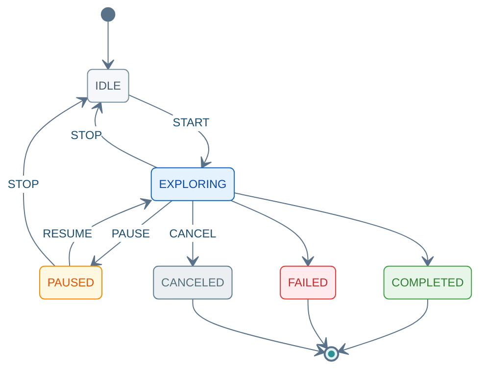

(rpc-exploration-command)=
# SendExplorationCommand

Unary 请求 → Server Stream 响应。`START` 前请先 [GetCapabilities](04_query_api.md) / [GetActiveTask](04_query_api.md)；Stream 以末帧 `ack.final=true` 结束。

---

## 8.1 方法签名

```protobuf
rpc SendExplorationCommand(ExplorationCommandRequest)
    returns (stream ExplorationCommandResponse);
```

---

## 8.2 Proto 定义

源文件：`autonomy/bridge/proto/external_command_service.proto`

```protobuf
enum ExplorationCommand {
  EXPLORATION_CMD_UNSPECIFIED = 0;
  EXPLORATION_CMD_START = 1;
  EXPLORATION_CMD_STOP = 2;
  EXPLORATION_CMD_PAUSE = 3;
  EXPLORATION_CMD_RESUME = 4;
  EXPLORATION_CMD_CANCEL = 5;
  EXPLORATION_CMD_SAVE_MAP = 6;
  EXPLORATION_CMD_SET_AREA = 7;
}

enum ExplorationStatus {
  EXPLORATION_STATUS_UNKNOWN = 0;
  EXPLORATION_STATUS_IDLE = 1;
  EXPLORATION_STATUS_EXPLORING = 2;
  EXPLORATION_STATUS_PAUSED = 3;
  EXPLORATION_STATUS_COMPLETED = 4;
  EXPLORATION_STATUS_FAILED = 5;
  EXPLORATION_STATUS_CANCELED = 6;
}

message ExplorationCommandRequest {
  RequestHeader header = 1;
  ExplorationCommand command = 2;
  oneof params {
    commsgs.proto.geometry_msgs.Polygon area = 3;
    string map_name = 4;
  }
}

message ExplorationCommandResponse {
  CommandAck ack = 1;
  ExplorationStatus status = 2;
  float explored_area = 3;
  float exploration_progress = 4;
}
```

---

## 8.3 字段说明

### Request · `ExplorationCommandRequest`

| 字段 | 类型 | 必填 | 说明 |
|------|------|:----:|------|
| `header` | `RequestHeader` | ✓ | [03 §3.1](03_common_types.md#31-requestheader) |
| `command` | `ExplorationCommand` | ✓ | 子命令；见下表 |
| `area` | `Polygon` | `SET_AREA` | 探索区域；`points[]` ≥ 3 |
| `map_name` | `string` | `SAVE_MAP` | 保存地图名称 |

**`ExplorationCommand` 枚举**

| 值 | 常量 | `params` / 说明 |
|:--:|------|-----------------|
| 1 | `EXPLORATION_CMD_START` | 开始探索 |
| 2 | `EXPLORATION_CMD_STOP` | 停止 → `IDLE` |
| 3 | `EXPLORATION_CMD_PAUSE` | 暂停 |
| 4 | `EXPLORATION_CMD_RESUME` | 从 `PAUSED` 恢复 |
| 5 | `EXPLORATION_CMD_CANCEL` | 取消任务 |
| 6 | `EXPLORATION_CMD_SAVE_MAP` | `map_name` |
| 7 | `EXPLORATION_CMD_SET_AREA` | `area` |

### Response · `ExplorationCommandResponse`

| 字段 | 类型 | 说明 |
|------|------|------|
| `ack` | `CommandAck` | 流应答；末帧 `final=true` · [03 §3.2](03_common_types.md#32-commandack) |
| `status` | `ExplorationStatus` | 探索阶段 |
| `explored_area` | `float` | 已探索面积 (m²) |
| `exploration_progress` | `float` | 进度 [0, 1] |

**`ExplorationStatus`**：`IDLE`(1) · `EXPLORING`(2) · `PAUSED`(3) · `COMPLETED`(4) · `FAILED`(5) · `CANCELED`(6)

<div class="nav-state-diagram">



</div>

---

## 8.4 示例（grpcurl）

**环境**：[01 §1.1](01_connection_guide.md#11-环境配置) · **TC 全集**：[13 §13.7](13_integration_tests.md#137-sendexplorationcommand-测试用例) · **JSON 参考**：[01 §1.4](01_connection_guide.md#14-响应-json-参考)

每张卡片上方 **发送指令**（蓝）、下方 **收到结果**（绿）；Stream 响应以末帧 `ack.final=true` 为准。

### 8.4.1 示例索引

| 编号 | 在干什么 | `command` | 末帧预期 | TC |
|:----:|----------|:---------:|----------|-----|
| [EXP-01](#exp-01) | 确认可探索、无残留任务 | — | 可探索 · 无活跃任务 | — |
| [EXP-02](#exp-02) | 限定探索 Polygon | 7 | `success=true` · `IDLE` | `TC-EXP-004` |
| [EXP-03](#exp-03) | 启动自主探索建图 | 1 | `EXPLORING` · progress 递增 | `TC-EXP-001` |
| [EXP-04](#exp-04) | 暂停探索 | 3 | `PAUSED` | `TC-EXP-002` |
| [EXP-05](#exp-05) | 暂停后恢复 | 4 | `EXPLORING` | `TC-EXP-002` |
| [EXP-06](#exp-06) | 保存探索地图 | 6 | `COMPLETED` / `IDLE` | `TC-EXP-003` |
| [EXP-07](#exp-07) | 取消任务 | 5 | `CANCELED` | — |

> `STOP`(2) 请求体同 [NAV-08](07_navigation_command.md#nav-08)，末帧 `EXPLORATION_STATUS_IDLE`。

---

(exp-01)=
### 8.4.2 EXP-01 · 前置检查

发 `START` 前确认：Bridge 支持探索，且当前无进行中的任务。

<div class="nav-card nav-card-single">

<div class="nav-card-meta">
<span class="nav-chip">GetCapabilities + GetActiveTask</span>
<span class="nav-chip nav-chip-out">可探索 · 无活跃任务</span>
</div>

<div class="nav-demo-grid">

<details class="nav-demo-panel nav-send">
<summary>发送指令</summary>

```bash
# EXP-01 · GetCapabilities + GetActiveTask
grpcurl -plaintext $PROTO_OPTS -d '{}' $BRIDGE $SVC/GetCapabilities
grpcurl -plaintext $PROTO_OPTS -d '{}' $BRIDGE $SVC/GetActiveTask
```

</details>

<details class="nav-demo-panel nav-recv">
<summary>收到结果</summary>

```json
{ "supportsExploration": true }
{ "type": "TASK_TYPE_NONE" }
```

</details>

</div>
</div>

---

### 8.4.3 启动

(exp-02)=
#### 8.4.3.1 EXP-02 · SET_AREA

在 `START` 前设置探索边界（矩形 Polygon 示例）。

<div class="nav-card">

<div class="nav-card-meta">
<span class="nav-chip">command <b>7</b> SET_AREA</span>
<span class="nav-chip nav-chip-hint">Polygon ≥ 3 点 · 20×15m</span>
<span class="nav-chip nav-chip-out">success=true · IDLE</span>
</div>

<div class="nav-demo-grid">

<details class="nav-demo-panel nav-send">
<summary>发送指令</summary>

```bash
# EXP-02 · SET_AREA(7)
export CMD_ID=$(new_cmd_id)

grpcurl -plaintext $PROTO_OPTS \
  -d @- \
  $BRIDGE \
  $SVC/SendExplorationCommand <<EOF
{
  "header": {
    "cmd_id": "${CMD_ID}"
  },
  "command": 7,
  "area": {
    "points": [
      { "x": 0,  "y": 0,  "z": 0 },
      { "x": 20, "y": 0,  "z": 0 },
      { "x": 20, "y": 15, "z": 0 },
      { "x": 0,  "y": 15, "z": 0 }
    ]
  }
}
EOF
```

</details>

<details class="nav-demo-panel nav-recv">
<summary>收到结果 · 末帧</summary>

```json
{
  "ack": { "success": true, "final": true },
  "status": "EXPLORATION_STATUS_IDLE"
}
```

</details>

</div>
</div>

(exp-03)=
#### 8.4.3.2 EXP-03 · START

启动 SLAM 探索：Stream 推送 `explorationProgress` / `exploredArea`，直至完成或中断。

<div class="nav-card">

<div class="nav-card-meta">
<span class="nav-chip">command <b>1</b> START</span>
<span class="nav-chip nav-chip-out">EXPLORING · progress 0→1</span>
</div>

<div class="nav-demo-grid">

<details class="nav-demo-panel nav-send">
<summary>发送指令</summary>

```bash
# EXP-03 · START(1)
export CMD_ID=$(new_cmd_id)

grpcurl -plaintext $PROTO_OPTS \
  -d @- \
  $BRIDGE \
  $SVC/SendExplorationCommand <<EOF
{
  "header": {
    "cmd_id": "${CMD_ID}"
  },
  "command": 1
}
EOF
```

</details>

<details class="nav-demo-panel nav-recv">
<summary>收到结果 · 流中帧</summary>

```json
{ "status": "EXPLORATION_STATUS_EXPLORING", "explorationProgress": 0.12, "exploredArea": 8.5 }
{ "status": "EXPLORATION_STATUS_EXPLORING", "explorationProgress": 0.45, "exploredArea": 32.0 }
```

</details>

</div>
</div>

---

### 8.4.4 运行控制

(exp-04)=
#### 8.4.4.1 EXP-04 · PAUSE

暂停探索（机器人停住，任务保持 `PAUSED`）。

**前提**：[EXP-03](#exp-03) 已 START 且 Stream 未结束 · **另开终端**发送。

<div class="nav-card">

<div class="nav-card-meta">
<span class="nav-chip">command <b>3</b> PAUSE</span>
<span class="nav-chip nav-chip-out">探索已暂停</span>
</div>

<div class="nav-demo-grid">

<details class="nav-demo-panel nav-send">
<summary>发送指令</summary>

```bash
# EXP-04 · PAUSE(3)
export CMD_ID=$(new_cmd_id)

grpcurl -plaintext $PROTO_OPTS \
  -d @- \
  $BRIDGE \
  $SVC/SendExplorationCommand <<EOF
{
  "header": { "cmd_id": "${CMD_ID}" },
  "command": 3
}
EOF
```

</details>

<details class="nav-demo-panel nav-recv">
<summary>收到结果 · 末帧</summary>

```json
{
  "ack": { "success": true, "final": true, "taskStatus": "TASK_STATUS_PAUSED" },
  "status": "EXPLORATION_STATUS_PAUSED"
}
```

</details>

</div>
</div>

(exp-05)=
#### 8.4.4.2 EXP-05 · RESUME

从暂停恢复探索。

**前提**：紧接 [EXP-04](#exp-04) PAUSE 之后发送。

<div class="nav-card">

<div class="nav-card-meta">
<span class="nav-chip">command <b>4</b> RESUME</span>
<span class="nav-chip nav-chip-out">恢复探索</span>
</div>

<div class="nav-demo-grid">

<details class="nav-demo-panel nav-send">
<summary>发送指令</summary>

```bash
# EXP-05 · RESUME(4)
export CMD_ID=$(new_cmd_id)

grpcurl -plaintext $PROTO_OPTS \
  -d @- \
  $BRIDGE \
  $SVC/SendExplorationCommand <<EOF
{
  "header": { "cmd_id": "${CMD_ID}" },
  "command": 4
}
EOF
```

</details>

<details class="nav-demo-panel nav-recv">
<summary>收到结果 · 流中帧</summary>

```json
{
  "status": "EXPLORATION_STATUS_EXPLORING",
  "explorationProgress": 0.52,
  "ack": { "success": true, "final": false }
}
```

</details>

</div>
</div>

---

### 8.4.5 结束

(exp-06)=
#### 8.4.5.1 EXP-06 · SAVE_MAP

探索进行中或结束后，将当前地图保存为指定名称。

<div class="nav-card">

<div class="nav-card-meta">
<span class="nav-chip">command <b>6</b> SAVE_MAP</span>
<span class="nav-chip">map_name <b>floor1</b></span>
<span class="nav-chip nav-chip-out">COMPLETED / IDLE</span>
</div>

<div class="nav-demo-grid">

<details class="nav-demo-panel nav-send">
<summary>发送指令</summary>

```bash
# EXP-06 · SAVE_MAP(6)
export CMD_ID=$(new_cmd_id)

grpcurl -plaintext $PROTO_OPTS \
  -d @- \
  $BRIDGE \
  $SVC/SendExplorationCommand <<EOF
{
  "header": {
    "cmd_id": "${CMD_ID}"
  },
  "command": 6,
  "map_name": "floor1"
}
EOF
```

</details>

<details class="nav-demo-panel nav-recv">
<summary>收到结果 · 末帧</summary>

```json
{
  "ack": { "success": true, "final": true, "taskStatus": "TASK_STATUS_SUCCEEDED" },
  "status": "EXPLORATION_STATUS_COMPLETED"
}
```

</details>

</div>
</div>

(exp-07)=
#### 8.4.5.2 EXP-07 · CANCEL

取消当前探索任务，释放任务槽，状态变为 `CANCELED`。

<div class="nav-card">

<div class="nav-card-meta">
<span class="nav-chip">command <b>5</b> CANCEL</span>
<span class="nav-chip nav-chip-out">任务已取消</span>
</div>

<div class="nav-demo-grid">

<details class="nav-demo-panel nav-send">
<summary>发送指令</summary>

```bash
# EXP-07 · CANCEL(5)
export CMD_ID=$(new_cmd_id)

grpcurl -plaintext $PROTO_OPTS \
  -d @- \
  $BRIDGE \
  $SVC/SendExplorationCommand <<EOF
{
  "header": { "cmd_id": "${CMD_ID}" },
  "command": 5
}
EOF
```

</details>

<details class="nav-demo-panel nav-recv">
<summary>收到结果 · 末帧</summary>

```json
{
  "ack": { "success": true, "final": true, "taskStatus": "TASK_STATUS_CANCELED" },
  "status": "EXPLORATION_STATUS_CANCELED"
}
```

</details>

</div>
</div>
