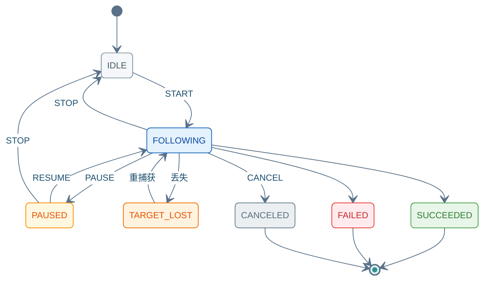

(rpc-follow-command)=
# SendFollowCommand

Unary 请求 → Server Stream 响应。`START` 前请先 [GetCapabilities](04_query_api.md) / [GetActiveTask](04_query_api.md)；Stream 以末帧 `ack.final=true` 结束。

---

## 9.1 方法签名

```protobuf
rpc SendFollowCommand(FollowCommandRequest)
    returns (stream FollowCommandResponse);
```

---

## 9.2 Proto 定义

源文件：`autonomy/bridge/proto/external_command_service.proto`

```protobuf
enum FollowMode {
  FOLLOW_MODE_UNSPECIFIED = 0;
  FOLLOW_MODE_PERSON = 1;
  FOLLOW_MODE_TARGET_POSE = 2;
  FOLLOW_MODE_TARGET_ID = 3;
}

enum FollowCommand {
  FOLLOW_CMD_UNSPECIFIED = 0;
  FOLLOW_CMD_START = 1;
  FOLLOW_CMD_STOP = 2;
  FOLLOW_CMD_PAUSE = 3;
  FOLLOW_CMD_RESUME = 4;
  FOLLOW_CMD_CANCEL = 5;
  FOLLOW_CMD_UPDATE_TARGET = 6;
}

enum FollowStatus {
  FOLLOW_STATUS_UNKNOWN = 0;
  FOLLOW_STATUS_IDLE = 1;
  FOLLOW_STATUS_FOLLOWING = 2;
  FOLLOW_STATUS_PAUSED = 3;
  FOLLOW_STATUS_TARGET_LOST = 4;
  FOLLOW_STATUS_SUCCEEDED = 5;
  FOLLOW_STATUS_FAILED = 6;
  FOLLOW_STATUS_CANCELED = 7;
}

message FollowCommandRequest {
  RequestHeader header = 1;
  FollowCommand command = 2;
  FollowMode mode = 3;
  float follow_distance = 4;
  float follow_angle = 5;
  float session_timeout_sec = 6;
  bool reacquire_on_lost = 7;
  oneof target {
    commsgs.proto.geometry_msgs.PoseStamped target_pose = 8;
    string target_id = 9;
  }
}

message FollowCommandResponse {
  CommandAck ack = 1;
  FollowStatus status = 2;
  float distance_to_target = 3;
  commsgs.proto.geometry_msgs.PoseStamped target_pose = 4;
}
```

---

## 9.3 字段说明

### Request · `FollowCommandRequest`

| 字段 | 类型 | 必填 | 说明 |
|------|------|:----:|------|
| `header` | `RequestHeader` | ✓ | [03 §3.1](03_common_types.md#31-requestheader) |
| `command` | `FollowCommand` | ✓ | 子命令；见下表 |
| `mode` | `FollowMode` | START | `1` 人体 · `2` 目标位姿 · `3` 目标 ID |
| `follow_distance` | `float` | — | 跟随距离 (m) |
| `follow_angle` | `float` | — | 跟随角度 (rad) |
| `session_timeout_sec` | `float` | — | 会话超时 (s) |
| `reacquire_on_lost` | `bool` | — | 目标丢失后是否重捕获 |
| `target_pose` | `PoseStamped` | `mode=2` | `oneof target` |
| `target_id` | `string` | `mode=3` | `oneof target` |

**`FollowCommand` 枚举**

| 值 | 常量 | 说明 |
|:--:|------|------|
| 1 | `FOLLOW_CMD_START` | 开始；需 `mode`（及 `target`） |
| 2 | `FOLLOW_CMD_STOP` | 停止 → `IDLE` |
| 3 | `FOLLOW_CMD_PAUSE` | 暂停 |
| 4 | `FOLLOW_CMD_RESUME` | 从 `PAUSED` 恢复 |
| 5 | `FOLLOW_CMD_CANCEL` | 取消任务 |
| 6 | `FOLLOW_CMD_UPDATE_TARGET` | 跟随中更新目标 |

### Response · `FollowCommandResponse`

| 字段 | 类型 | 说明 |
|------|------|------|
| `ack` | `CommandAck` | 流应答；末帧 `final=true` · [03 §3.2](03_common_types.md#32-commandack) |
| `status` | `FollowStatus` | 跟随阶段 |
| `distance_to_target` | `float` | 与目标距离 (m) |
| `target_pose` | `PoseStamped` | 当前目标位姿 |

**`FollowStatus`**：`IDLE`(1) · `FOLLOWING`(2) · `PAUSED`(3) · `TARGET_LOST`(4) · `SUCCEEDED`(5) · `FAILED`(6) · `CANCELED`(7)

<div class="nav-state-diagram">



</div>

---

## 9.4 示例（grpcurl）

**环境**：[01 §1.1](01_connection_guide.md#11-环境配置) · **TC 全集**：[13 §13.8](13_integration_tests.md#138-sendfollowcommand-测试用例) · **JSON 参考**：[01 §1.4](01_connection_guide.md#14-响应-json-参考)

每张卡片上方 **发送指令**（蓝）、下方 **收到结果**（绿）；Stream 响应以末帧 `ack.final=true` 为准。

### 9.4.1 示例索引

| 编号 | 在干什么 | `command` | 末帧预期 | TC |
|:----:|----------|:---------:|----------|-----|
| [FOL-01](#fol-01) | 确认可跟随、无残留任务 | — | 可跟随 · 无活跃任务 | — |
| [FOL-02](#fol-02) | 人体跟随 | 1 | `FOLLOWING` | `TC-FOL-001` |
| [FOL-03](#fol-03) | 目标位姿跟随 | 1 | `FOLLOWING` · 距离≈设定 | `TC-FOL-002` |
| [FOL-04](#fol-04) | 暂停跟随 | 3 | `PAUSED` | — |
| [FOL-05](#fol-05) | 暂停后恢复 | 4 | `FOLLOWING` | — |
| [FOL-06](#fol-06) | 跟随中更新目标 | 6 | `FOLLOWING` · `targetPose` 变 | `TC-FOL-003` |
| [FOL-07](#fol-07) | 取消任务 | 5 | `CANCELED` | — |

> `STOP`(2) 请求体同 [NAV-08](07_navigation_command.md#nav-08)，末帧 `FOLLOW_STATUS_IDLE`。

---

(fol-01)=
### 9.4.2 FOL-01 · 前置检查

发 `START` 前确认：Bridge 支持跟随，且当前无进行中的任务。

<div class="nav-card nav-card-single">

<div class="nav-card-meta">
<span class="nav-chip">GetCapabilities + GetActiveTask</span>
<span class="nav-chip nav-chip-out">可跟随 · 无活跃任务</span>
</div>

<div class="nav-demo-grid">

<details class="nav-demo-panel nav-send">
<summary>发送指令</summary>

```bash
# FOL-01 · GetCapabilities + GetActiveTask
grpcurl -plaintext $PROTO_OPTS -d '{}' $BRIDGE $SVC/GetCapabilities
grpcurl -plaintext $PROTO_OPTS -d '{}' $BRIDGE $SVC/GetActiveTask
```

</details>

<details class="nav-demo-panel nav-recv">
<summary>收到结果</summary>

```json
{ "supportsFollow": true }
{ "type": "TASK_TYPE_NONE" }
```

</details>

</div>
</div>

---

### 9.4.3 启动

(fol-02)=
#### 9.4.3.1 FOL-02 · START 行人

`mode=1`：跟踪检测到的人体，保持 `follow_distance` 间距。

<div class="nav-card">

<div class="nav-card-meta">
<span class="nav-chip">command <b>1</b> · mode <b>1</b></span>
<span class="nav-chip nav-chip-out">FOLLOW_STATUS_FOLLOWING</span>
</div>

<div class="nav-demo-grid">

<details class="nav-demo-panel nav-send">
<summary>发送指令</summary>

```bash
# FOL-02 · START(1) mode=1
export CMD_ID=$(new_cmd_id)

grpcurl -plaintext $PROTO_OPTS \
  -d @- \
  $BRIDGE \
  $SVC/SendFollowCommand <<EOF
{
  "header": {
    "cmd_id": "${CMD_ID}"
  },
  "command": 1,
  "mode": 1,
  "follow_distance": 1.5,
  "reacquire_on_lost": true
}
EOF
```

</details>

<details class="nav-demo-panel nav-recv">
<summary>收到结果 · 流中帧</summary>

```json
{
  "status": "FOLLOW_STATUS_FOLLOWING",
  "distanceToTarget": 1.48,
  "ack": { "success": true, "final": false }
}
```

</details>

</div>
</div>

(fol-03)=
#### 9.4.3.2 FOL-03 · START 目标位姿

`mode=2`：跟随地图中指定 `target_pose`，适合虚拟目标或预置航点。

<div class="nav-card">

<div class="nav-card-meta">
<span class="nav-chip">command <b>1</b> · mode <b>2</b></span>
<span class="nav-chip nav-chip-out">FOLLOWING</span>
</div>

<div class="nav-demo-grid">

<details class="nav-demo-panel nav-send">
<summary>发送指令</summary>

```bash
# FOL-03 · START(1) mode=2
export CMD_ID=$(new_cmd_id)

grpcurl -plaintext $PROTO_OPTS \
  -d @- \
  $BRIDGE \
  $SVC/SendFollowCommand <<EOF
{
  "header": {
    "cmd_id": "${CMD_ID}"
  },
  "command": 1,
  "mode": 2,
  "follow_distance": 2.0,
  "target_pose": {
    "header": {
      "frame_id": "map"
    },
    "pose": {
      "position": {
        "x": 5,
        "y": 3
      },
      "orientation": {
        "w": 1.0
      }
    }
  }
}
EOF
```

</details>

<details class="nav-demo-panel nav-recv">
<summary>收到结果 · 流中帧</summary>

```json
{
  "status": "FOLLOW_STATUS_FOLLOWING",
  "distanceToTarget": 1.95,
  "targetPose": {
    "header": { "frameId": "map" },
    "pose": { "position": { "x": 5.0, "y": 3.0 } }
  }
}
```

</details>

</div>
</div>

---

### 9.4.4 运行控制

(fol-04)=
#### 9.4.4.1 FOL-04 · PAUSE

暂停跟随（机器人停住，任务保持 `PAUSED`）。

**前提**：[FOL-02/03](#fol-02) 已 START · **另开终端**发送。

<div class="nav-card">

<div class="nav-card-meta">
<span class="nav-chip">command <b>3</b> PAUSE</span>
<span class="nav-chip nav-chip-out">跟随已暂停</span>
</div>

<div class="nav-demo-grid">

<details class="nav-demo-panel nav-send">
<summary>发送指令</summary>

```bash
# FOL-04 · PAUSE(3)
export CMD_ID=$(new_cmd_id)

grpcurl -plaintext $PROTO_OPTS \
  -d @- \
  $BRIDGE \
  $SVC/SendFollowCommand <<EOF
{
  "header": { "cmd_id": "${CMD_ID}" },
  "command": 3
}
EOF
```

</details>

<details class="nav-demo-panel nav-recv">
<summary>收到结果 · 末帧</summary>

```json
{
  "ack": { "success": true, "final": true, "taskStatus": "TASK_STATUS_PAUSED" },
  "status": "FOLLOW_STATUS_PAUSED"
}
```

</details>

</div>
</div>

(fol-05)=
#### 9.4.4.2 FOL-05 · RESUME

从暂停恢复跟随。

**前提**：紧接 [FOL-04](#fol-04) PAUSE 之后发送。

<div class="nav-card">

<div class="nav-card-meta">
<span class="nav-chip">command <b>4</b> RESUME</span>
<span class="nav-chip nav-chip-out">恢复跟随</span>
</div>

<div class="nav-demo-grid">

<details class="nav-demo-panel nav-send">
<summary>发送指令</summary>

```bash
# FOL-05 · RESUME(4)
export CMD_ID=$(new_cmd_id)

grpcurl -plaintext $PROTO_OPTS \
  -d @- \
  $BRIDGE \
  $SVC/SendFollowCommand <<EOF
{
  "header": { "cmd_id": "${CMD_ID}" },
  "command": 4
}
EOF
```

</details>

<details class="nav-demo-panel nav-recv">
<summary>收到结果 · 流中帧</summary>

```json
{
  "status": "FOLLOW_STATUS_FOLLOWING",
  "ack": { "success": true, "final": false }
}
```

</details>

</div>
</div>

(fol-06)=
#### 9.4.4.3 FOL-06 · UPDATE_TARGET

**前提**：已有进行中的跟随任务（`FOLLOWING`）。动态更新目标位姿，状态保持 `FOLLOWING`。

<div class="nav-card">

<div class="nav-card-meta">
<span class="nav-chip">command <b>6</b> UPDATE_TARGET</span>
<span class="nav-chip nav-chip-hint">跟随进行中</span>
<span class="nav-chip nav-chip-out">FOLLOWING · targetPose 更新</span>
</div>

<div class="nav-demo-grid">

<details class="nav-demo-panel nav-send">
<summary>发送指令</summary>

```bash
# FOL-06 · UPDATE_TARGET(6)
export CMD_ID=$(new_cmd_id)

grpcurl -plaintext $PROTO_OPTS \
  -d @- \
  $BRIDGE \
  $SVC/SendFollowCommand <<EOF
{
  "header": {
    "cmd_id": "${CMD_ID}"
  },
  "command": 6,
  "mode": 2,
  "target_pose": {
    "header": { "frame_id": "map" },
    "pose": { "position": { "x": 8.0, "y": 4.0 } }
  }
}
EOF
```

</details>

<details class="nav-demo-panel nav-recv">
<summary>收到结果 · 流中帧</summary>

```json
{
  "status": "FOLLOW_STATUS_FOLLOWING",
  "targetPose": {
    "pose": { "position": { "x": 8.0, "y": 4.0 } }
  },
  "ack": { "success": true, "final": false }
}
```

</details>

</div>
</div>

---

### 9.4.5 结束

(fol-07)=
#### 9.4.5.1 FOL-07 · CANCEL

取消当前跟随任务，释放任务槽，状态变为 `CANCELED`。

<div class="nav-card">

<div class="nav-card-meta">
<span class="nav-chip">command <b>5</b> CANCEL</span>
<span class="nav-chip nav-chip-out">任务已取消</span>
</div>

<div class="nav-demo-grid">

<details class="nav-demo-panel nav-send">
<summary>发送指令</summary>

```bash
# FOL-07 · CANCEL(5)
export CMD_ID=$(new_cmd_id)

grpcurl -plaintext $PROTO_OPTS \
  -d @- \
  $BRIDGE \
  $SVC/SendFollowCommand <<EOF
{
  "header": { "cmd_id": "${CMD_ID}" },
  "command": 5
}
EOF
```

</details>

<details class="nav-demo-panel nav-recv">
<summary>收到结果 · 末帧</summary>

```json
{
  "ack": { "success": true, "final": true, "taskStatus": "TASK_STATUS_CANCELED" },
  "status": "FOLLOW_STATUS_CANCELED"
}
```

</details>

</div>
</div>

> 目标丢失（`TARGET_LOST`）场景见 [13 §13.8 TC-FOL-004](13_integration_tests.md#tc-fol-004)。
