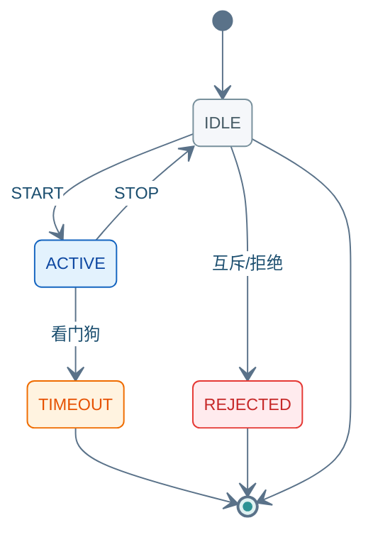

(rpc-teleop-command)=
# SendTeleopCommand

**Bidi** Stream：客户端持续发送 `VELOCITY` 帧，服务端 Stream 应答。与其他 Command **互斥**；`watchdog_timeout_sec` 内无 `VELOCITY` 则自动 `STOP` / `TIMEOUT`。

---

## 10.1 方法签名

```protobuf
rpc SendTeleopCommand(stream TeleopCommandRequest)
    returns (stream TeleopCommandResponse);
```

---

## 10.2 Proto 定义

源文件：`autonomy/bridge/proto/external_command_service.proto`

```protobuf
enum TeleopCommand {
  TELEOP_CMD_UNSPECIFIED = 0;
  TELEOP_CMD_START = 1;
  TELEOP_CMD_STOP = 2;
  TELEOP_CMD_VELOCITY = 3;
}

enum TeleopStatus {
  TELEOP_STATUS_UNKNOWN = 0;
  TELEOP_STATUS_IDLE = 1;
  TELEOP_STATUS_ACTIVE = 2;
  TELEOP_STATUS_TIMEOUT = 3;
  TELEOP_STATUS_REJECTED = 4;
}

message TeleopCommandRequest {
  RequestHeader header = 1;
  TeleopCommand command = 2;
  commsgs.proto.geometry_msgs.TwistStamped velocity = 3;  // VELOCITY 时必填
  commsgs.proto.builtin_interfaces.Duration session_timeout = 4;
  float max_linear_speed = 5;
  float max_angular_speed = 6;
  float watchdog_timeout_sec = 7;   // 无速度指令超时自动 STOP，0 = 默认
  bool disable_collision_checks = 8;
}

message TeleopCommandResponse {
  CommandAck ack = 1;
  TeleopStatus status = 2;
}
```

---

## 10.3 字段说明

### Request · `TeleopCommandRequest`

| 字段 | 类型 | 必填 | 说明 |
|------|------|:----:|------|
| `header` | `RequestHeader` | ✓ | [03 §3.1](03_common_types.md#31-requestheader) |
| `command` | `TeleopCommand` | ✓ | 子命令；见下表 |
| `velocity` | `TwistStamped` | `VELOCITY` | 速度指令；Bidi 高频发送 |
| `session_timeout` | `Duration` | — | 会话总超时 |
| `max_linear_speed` | `float` | — | 线速度上限 (m/s) |
| `max_angular_speed` | `float` | — | 角速度上限 (rad/s) |
| `watchdog_timeout_sec` | `float` | — | 无 `VELOCITY` 超时；`0` = 默认 |
| `disable_collision_checks` | `bool` | — | 是否跳过碰撞检测 |

**`TeleopCommand` 枚举**

| 值 | 常量 | 说明 |
|:--:|------|------|
| 1 | `TELEOP_CMD_START` | 开启遥操会话 |
| 2 | `TELEOP_CMD_STOP` | 结束会话 → `IDLE` |
| 3 | `TELEOP_CMD_VELOCITY` | 发送速度（需会话 `ACTIVE`） |

### Response · `TeleopCommandResponse`

| 字段 | 类型 | 说明 |
|------|------|------|
| `ack` | `CommandAck` | 流应答；末帧 `final=true` · [03 §3.2](03_common_types.md#32-commandack) |
| `status` | `TeleopStatus` | 遥操阶段 |

**`TeleopStatus`**：`IDLE`(1) · `ACTIVE`(2) · `TIMEOUT`(3) · `REJECTED`(4)

<div class="nav-state-diagram">



</div>

> `VELOCITY` 不改变 `TeleopStatus`（保持 `ACTIVE`），仅驱动底盘运动；连续发送见 [13 §13.14](13_integration_tests.md#1314-python-集成测试脚本)。

---

## 10.4 示例（grpcurl）

**环境**：[01 §1.1](01_connection_guide.md#11-环境配置) · **TC 全集**：[13 §13.9](13_integration_tests.md#139-sendteleopcommand-测试用例) · **Bidi 完整测试**：[13 §13.14](13_integration_tests.md#1314-python-集成测试脚本)

Bidi Stream：上方 **发送指令**（蓝）、下方 **收到结果**（绿）。连续 `VELOCITY` 需 Python 客户端；grpcurl 仅适合 START / 看门狗超时探测。

### 10.4.1 示例索引

| 编号 | 在干什么 | `command` | 末帧预期 | TC |
|:----:|----------|:---------:|----------|-----|
| [TEL-01](#tel-01) | 前置检查 · 确认无冲突任务 | — | 无活跃任务 | — |
| [TEL-02](#tel-02) | 开启会话并测看门狗 | 1 | 无 VELOCITY → `TIMEOUT` | `TC-TEL-001` |
| [TEL-03](#tel-03) | 结束遥操会话 | 2 | `IDLE` | `TC-TEL-003` |
| [TEL-04](#tel-04) | 连续 VELOCITY（Bidi） | 3 | `ACTIVE` | `TC-TEL-002` |

---

(tel-01)=
### 10.4.2 TEL-01 · 前置检查

发 `START` 前确认无其他 Command 占用任务槽（遥操与其他任务互斥）。

<div class="nav-card nav-card-single">

<div class="nav-card-meta">
<span class="nav-chip">GetActiveTask</span>
<span class="nav-chip nav-chip-out">无活跃任务</span>
</div>

<div class="nav-demo-grid">

<details class="nav-demo-panel nav-send">
<summary>发送指令</summary>

```bash
# TEL-01 · GetActiveTask
grpcurl -plaintext $PROTO_OPTS -d '{}' $BRIDGE $SVC/GetActiveTask
```

</details>

<details class="nav-demo-panel nav-recv">
<summary>收到结果</summary>

```json
{ "type": "TASK_TYPE_NONE" }
```

</details>

</div>
</div>

---

(tel-02)=
### 10.4.3 TEL-02 · START 看门狗

仅发送 `START`，不跟 `VELOCITY`：`watchdog_timeout_sec` 到期后 Stream 末帧为 `TIMEOUT`。

<div class="nav-card">

<div class="nav-card-meta">
<span class="nav-chip">command <b>1</b> START</span>
<span class="nav-chip">watchdog <b>2.0</b>s</span>
<span class="nav-chip nav-chip-hint">VELOCITY 见 <a href="13_integration_tests.md#1314-python-集成测试脚本">13 §13.14</a></span>
<span class="nav-chip nav-chip-out">ACTIVE → TIMEOUT</span>
</div>

<div class="nav-demo-grid">

<details class="nav-demo-panel nav-send">
<summary>发送指令</summary>

```bash
# TEL-02 · START(1) — 仅测看门狗超时
export CMD_ID=$(new_cmd_id)

grpcurl -plaintext $PROTO_OPTS \
  -d @- \
  $BRIDGE \
  $SVC/SendTeleopCommand <<EOF
{
  "header": {
    "cmd_id": "${CMD_ID}"
  },
  "command": 1,
  "watchdog_timeout_sec": 2.0,
  "max_linear_speed": 0.5,
  "max_angular_speed": 1.0
}
EOF
```

</details>

<details class="nav-demo-panel nav-recv">
<summary>收到结果 · 首帧 + 超时末帧</summary>

```json
{ "status": "TELEOP_STATUS_ACTIVE", "ack": { "success": true, "final": false } }
{
  "status": "TELEOP_STATUS_TIMEOUT",
  "ack": { "success": true, "final": true, "taskStatus": "TASK_STATUS_IDLE" }
}
```

</details>

</div>
</div>

(tel-03)=
### 10.4.4 TEL-03 · STOP

结束遥操会话，底盘停止，任务槽释放。

**前提**：已有 `ACTIVE` 遥操会话（[TEL-02](#tel-02) 或 Python Bidi）。

<div class="nav-card">

<div class="nav-card-meta">
<span class="nav-chip">command <b>2</b> STOP</span>
<span class="nav-chip nav-chip-out">IDLE</span>
</div>

<div class="nav-demo-grid">

<details class="nav-demo-panel nav-send">
<summary>发送指令</summary>

```bash
# TEL-03 · STOP(2)
export CMD_ID=$(new_cmd_id)

grpcurl -plaintext $PROTO_OPTS \
  -d @- \
  $BRIDGE \
  $SVC/SendTeleopCommand <<EOF
{
  "header": { "cmd_id": "${CMD_ID}" },
  "command": 2
}
EOF
```

</details>

<details class="nav-demo-panel nav-recv">
<summary>收到结果 · 末帧</summary>

```json
{
  "status": "TELEOP_STATUS_IDLE",
  "ack": { "success": true, "final": true, "taskStatus": "TASK_STATUS_IDLE" }
}
```

</details>

</div>
</div>

(tel-04)=
### 10.4.5 TEL-04 · VELOCITY（Python）

连续发送 `command=3` + `velocity` 需 **Bidi Stream**，grpcurl 无法完整模拟。

<div class="nav-card nav-card-single">

<div class="nav-card-meta">
<span class="nav-chip">command <b>3</b> VELOCITY</span>
<span class="nav-chip nav-chip-hint">Bidi · 约 100ms/帧</span>
<span class="nav-chip nav-chip-out">ACTIVE</span>
</div>

<div class="nav-demo-grid">

<details class="nav-demo-panel nav-send">
<summary>发送指令</summary>

```python
# TEL-04 · 见 13 §13.14 Python 集成脚本
# 每 100ms: command=3 + twist.linear.x / angular.z
```

</details>

<details class="nav-demo-panel nav-recv">
<summary>收到结果 · 流中帧</summary>

```json
{ "status": "TELEOP_STATUS_ACTIVE", "ack": { "success": true, "final": false } }
```

</details>

</div>
</div>

完整脚本 → [13 §13.14](13_integration_tests.md#1314-python-集成测试脚本)
