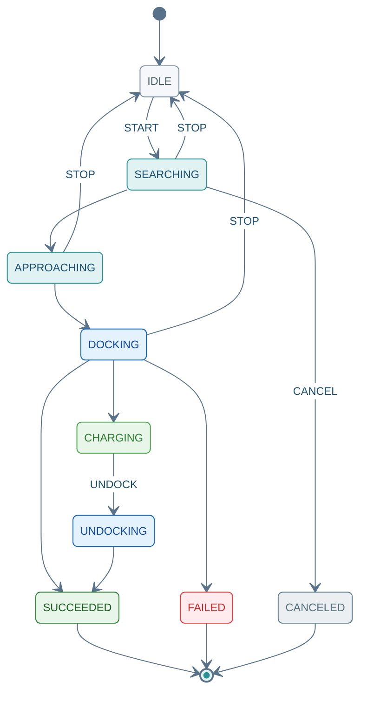

(rpc-dock-command)=
# SendDockCommand

Unary 请求 → Server Stream 响应。`START` 前请先 [GetCapabilities](04_query_api.md) / [GetActiveTask](04_query_api.md)；Stream 以末帧 `ack.final=true` 结束。

---

## 11.1 方法签名

```protobuf
rpc SendDockCommand(DockCommandRequest)
    returns (stream DockCommandResponse);
```

---

## 11.2 Proto 定义

源文件：`autonomy/bridge/proto/external_command_service.proto`

```protobuf
enum DockCommand {
  DOCK_CMD_UNSPECIFIED = 0;
  DOCK_CMD_START = 1;
  DOCK_CMD_STOP = 2;
  DOCK_CMD_PAUSE = 3;
  DOCK_CMD_RESUME = 4;
  DOCK_CMD_CANCEL = 5;
  DOCK_CMD_UNDOCK = 6;
}

enum DockStatus {
  DOCK_STATUS_UNKNOWN = 0;
  DOCK_STATUS_IDLE = 1;
  DOCK_STATUS_SEARCHING = 2;
  DOCK_STATUS_APPROACHING = 3;
  DOCK_STATUS_DOCKING = 4;
  DOCK_STATUS_CHARGING = 5;
  DOCK_STATUS_UNDOCKING = 6;
  DOCK_STATUS_SUCCEEDED = 7;
  DOCK_STATUS_FAILED = 8;
  DOCK_STATUS_CANCELED = 9;
}

message DockCommandRequest {
  RequestHeader header = 1;
  DockCommand command = 2;
  float max_search_radius = 3;
  int32 max_retry_count = 4;
  oneof dock_target {
    string dock_station_id = 5;
    commsgs.proto.geometry_msgs.PoseStamped dock_pose = 6;
  }
}

message DockCommandResponse {
  CommandAck ack = 1;
  DockStatus status = 2;
  float battery_percent = 3;
  string dock_station_id = 4;
}
```

---

## 11.3 字段说明

### Request · `DockCommandRequest`

| 字段 | 类型 | 必填 | 说明 |
|------|------|:----:|------|
| `header` | `RequestHeader` | ✓ | [03 §3.1](03_common_types.md#31-requestheader) |
| `command` | `DockCommand` | ✓ | 子命令；见下表 |
| `max_search_radius` | `float` | START | 搜索充电桩半径 (m) |
| `max_retry_count` | `int32` | — | 最大重试次数 |
| `dock_station_id` | `string` | START | `oneof dock_target`：按 ID |
| `dock_pose` | `PoseStamped` | START | `oneof dock_target`：按位姿 |

**`DockCommand` 枚举**

| 值 | 常量 | 说明 |
|:--:|------|------|
| 1 | `DOCK_CMD_START` | 开始对接；需 `dock_target` 之一 |
| 2 | `DOCK_CMD_STOP` | 停止 → `IDLE` |
| 3 | `DOCK_CMD_PAUSE` | 暂停 |
| 4 | `DOCK_CMD_RESUME` | 从 `PAUSED` 恢复 |
| 5 | `DOCK_CMD_CANCEL` | 取消任务 |
| 6 | `DOCK_CMD_UNDOCK` | 离桩（通常自 `CHARGING`） |

### Response · `DockCommandResponse`

| 字段 | 类型 | 说明 |
|------|------|------|
| `ack` | `CommandAck` | 流应答；末帧 `final=true` · [03 §3.2](03_common_types.md#32-commandack) |
| `status` | `DockStatus` | 对接阶段 |
| `battery_percent` | `float` | 当前电量 (%) |
| `dock_station_id` | `string` | 已对接桩 ID |

**`DockStatus`**：`IDLE`(1) · `SEARCHING`(2) · `APPROACHING`(3) · `DOCKING`(4) · `CHARGING`(5) · `UNDOCKING`(6) · `SUCCEEDED`(7) · `FAILED`(8) · `CANCELED`(9)

<div class="nav-state-diagram">



</div>

---

## 11.4 示例（grpcurl）

**环境**：[01 §1.1](01_connection_guide.md#11-环境配置) · **TC 全集**：[13 §13.10](13_integration_tests.md#1310-senddockcommand-测试用例) · **JSON 参考**：[01 §1.4](01_connection_guide.md#14-响应-json-参考)

每张卡片上方 **发送指令**（蓝）、下方 **收到结果**（绿）；Stream 响应以末帧 `ack.final=true` 为准。

### 11.4.1 示例索引

| 编号 | 在干什么 | `command` | 末帧预期 | TC |
|:----:|----------|:---------:|----------|-----|
| [DCK-01](#dck-01) | 确认可回充、无残留任务 | — | 可回充 · 无活跃任务 | — |
| [DCK-02](#dck-02) | 按站点 ID 自主对接 | 1 | `SUCCEEDED` · 充电中 | `TC-DCK-001` |
| [DCK-03](#dck-03) | 按位姿自主对接 | 1 | `SUCCEEDED` | `TC-DCK-002` |
| [DCK-04](#dck-04) | 离桩脱离 | 6 | `UNDOCKING` → `SUCCEEDED` | `TC-DCK-003` |
| [DCK-05](#dck-05) | 取消对接任务 | 5 | `CANCELED` | — |

> `STOP`(2) / `PAUSE`(3) / `RESUME`(4) 请求体字段同对应 `command` 枚举；`STOP` 末帧回 `DOCK_STATUS_IDLE`。

---

(dck-01)=
### 11.4.2 DCK-01 · 前置检查

发 `START` 前确认：Bridge 支持回充，且当前无进行中的任务。

<div class="nav-card nav-card-single">

<div class="nav-card-meta">
<span class="nav-chip">GetCapabilities + GetActiveTask</span>
<span class="nav-chip nav-chip-out">可回充 · 无活跃任务</span>
</div>

<div class="nav-demo-grid">

<details class="nav-demo-panel nav-send">
<summary>发送指令</summary>

```bash
# DCK-01 · GetCapabilities + GetActiveTask
grpcurl -plaintext $PROTO_OPTS -d '{}' $BRIDGE $SVC/GetCapabilities
grpcurl -plaintext $PROTO_OPTS -d '{}' $BRIDGE $SVC/GetActiveTask
```

</details>

<details class="nav-demo-panel nav-recv">
<summary>收到结果</summary>

```json
{ "supportsDocking": true }
{ "type": "TASK_TYPE_NONE" }
```

</details>

</div>
</div>

---

### 11.4.3 对接

(dck-02)=
#### 11.4.3.1 DCK-02 · START 按站点

指定 `dock_station_id`，自主搜索并对接到充电桩。

<div class="nav-card">

<div class="nav-card-meta">
<span class="nav-chip">command <b>1</b> START</span>
<span class="nav-chip">dock_station_id <b>station_a</b></span>
<span class="nav-chip nav-chip-out">SEARCHING → DOCKING → SUCCEEDED</span>
</div>

<div class="nav-demo-grid">

<details class="nav-demo-panel nav-send">
<summary>发送指令</summary>

```bash
# DCK-02 · START(1) dock_station_id
export CMD_ID=$(new_cmd_id)

grpcurl -plaintext $PROTO_OPTS \
  -d @- \
  $BRIDGE \
  $SVC/SendDockCommand <<EOF
{
  "header": {
    "cmd_id": "${CMD_ID}"
  },
  "command": 1,
  "dock_station_id": "station_a",
  "max_search_radius": 5.0
}
EOF
```

</details>

<details class="nav-demo-panel nav-recv">
<summary>收到结果 · 末帧</summary>

```json
{
  "ack": { "success": true, "final": true, "taskStatus": "TASK_STATUS_SUCCEEDED" },
  "status": "DOCK_STATUS_SUCCEEDED",
  "batteryPercent": 45.0,
  "dockStationId": "station_a"
}
```

</details>

</div>
</div>

(dck-03)=
#### 11.4.3.2 DCK-03 · START 按位姿

指定 `dock_pose`，自主搜索并对接到地图中的充电桩位姿。

<div class="nav-card">

<div class="nav-card-meta">
<span class="nav-chip">command <b>1</b> START</span>
<span class="nav-chip">dock_pose · map</span>
<span class="nav-chip nav-chip-out">SEARCHING → SUCCEEDED</span>
</div>

<div class="nav-demo-grid">

<details class="nav-demo-panel nav-send">
<summary>发送指令</summary>

```bash
# DCK-03 · START(1) dock_pose
export CMD_ID=$(new_cmd_id)

grpcurl -plaintext $PROTO_OPTS \
  -d @- \
  $BRIDGE \
  $SVC/SendDockCommand <<EOF
{
  "header": {
    "cmd_id": "${CMD_ID}"
  },
  "command": 1,
  "dock_pose": {
    "header": { "frame_id": "map" },
    "pose": {
      "position": { "x": 0.5, "y": 0.0 },
      "orientation": { "w": 1.0 }
    }
  },
  "max_search_radius": 5.0
}
EOF
```

</details>

<details class="nav-demo-panel nav-recv">
<summary>收到结果 · 末帧</summary>

```json
{
  "ack": { "success": true, "final": true, "taskStatus": "TASK_STATUS_SUCCEEDED" },
  "status": "DOCK_STATUS_SUCCEEDED",
  "batteryPercent": 42.0
}
```

</details>

</div>
</div>

---

### 11.4.4 离桩与取消

(dck-04)=
#### 11.4.4.1 DCK-04 · UNDOCK

**前提**：已对接（`CHARGING` 或 `SUCCEEDED`）。发送离桩指令，脱离充电桩。

<div class="nav-card">

<div class="nav-card-meta">
<span class="nav-chip">command <b>6</b> UNDOCK</span>
<span class="nav-chip nav-chip-hint">已对接 / 充电中</span>
<span class="nav-chip nav-chip-out">UNDOCKING → SUCCEEDED</span>
</div>

<div class="nav-demo-grid">

<details class="nav-demo-panel nav-send">
<summary>发送指令</summary>

```bash
# DCK-04 · UNDOCK(6)
export CMD_ID=$(new_cmd_id)

grpcurl -plaintext $PROTO_OPTS \
  -d @- \
  $BRIDGE \
  $SVC/SendDockCommand <<EOF
{
  "header": {
    "cmd_id": "${CMD_ID}"
  },
  "command": 6
}
EOF
```

</details>

<details class="nav-demo-panel nav-recv">
<summary>收到结果 · 末帧</summary>

```json
{
  "ack": { "success": true, "final": true, "taskStatus": "TASK_STATUS_SUCCEEDED" },
  "status": "DOCK_STATUS_SUCCEEDED"
}
```

</details>

</div>
</div>

(dck-05)=
#### 11.4.4.2 DCK-05 · CANCEL

取消进行中的对接任务，状态变为 `CANCELED`。

<div class="nav-card">

<div class="nav-card-meta">
<span class="nav-chip">command <b>5</b> CANCEL</span>
<span class="nav-chip nav-chip-out">任务已取消</span>
</div>

<div class="nav-demo-grid">

<details class="nav-demo-panel nav-send">
<summary>发送指令</summary>

```bash
# DCK-05 · CANCEL(5)
export CMD_ID=$(new_cmd_id)

grpcurl -plaintext $PROTO_OPTS \
  -d @- \
  $BRIDGE \
  $SVC/SendDockCommand <<EOF
{
  "header": { "cmd_id": "${CMD_ID}" },
  "command": 5
}
EOF
```

</details>

<details class="nav-demo-panel nav-recv">
<summary>收到结果 · 末帧</summary>

```json
{
  "ack": { "success": true, "final": true, "taskStatus": "TASK_STATUS_CANCELED" },
  "status": "DOCK_STATUS_CANCELED"
}
```

</details>

</div>
</div>
