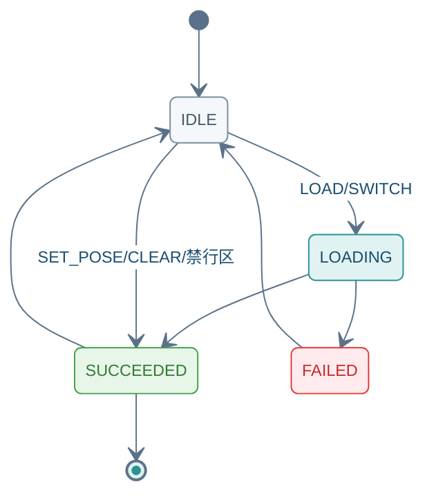

(rpc-map-command)=
# SendMapCommand

Unary 请求 → Server Stream 响应。地图操作前请先 [GetCapabilities](04_query_api.md) / [GetActiveTask](04_query_api.md)；Stream 以末帧 `ack.final=true` 结束。

---

## 12.1 方法签名

```protobuf
rpc SendMapCommand(MapCommandRequest)
    returns (stream MapCommandResponse);
```

---

## 12.2 Proto 定义

源文件：`autonomy/bridge/proto/external_command_service.proto`

```protobuf
enum MapCommand {
  MAP_CMD_UNSPECIFIED = 0;
  MAP_CMD_LOAD = 1;
  MAP_CMD_SWITCH = 2;
  MAP_CMD_SET_INITIAL_POSE = 3;
  MAP_CMD_CLEAR_COSTMAP = 4;
  MAP_CMD_ADD_KEEP_OUT_ZONE = 5;
  MAP_CMD_REMOVE_KEEP_OUT_ZONE = 6;
}

enum MapStatus {
  MAP_STATUS_UNKNOWN = 0;
  MAP_STATUS_IDLE = 1;
  MAP_STATUS_LOADING = 2;
  MAP_STATUS_SUCCEEDED = 3;
  MAP_STATUS_FAILED = 4;
}

message MapCommandRequest {
  RequestHeader header = 1;
  MapCommand command = 2;
  oneof params {
    string map_name = 3;
    commsgs.proto.geometry_msgs.PoseWithCovarianceStamped initial_pose = 4;
    commsgs.proto.geometry_msgs.Polygon keep_out_zone = 5;
    string zone_id = 6;
  }
}

message MapCommandResponse {
  CommandAck ack = 1;
  MapStatus status = 2;
  string current_map_name = 3;
}
```

---

## 12.3 字段说明

### Request · `MapCommandRequest`

| 字段 | 类型 | 必填 | 说明 |
|------|------|:----:|------|
| `header` | `RequestHeader` | ✓ | [03 §3.1](03_common_types.md#31-requestheader) |
| `command` | `MapCommand` | ✓ | 子命令；见下表 |
| `map_name` | `string` | `LOAD`/`SWITCH` | `oneof params` |
| `initial_pose` | `PoseWithCovarianceStamped` | `SET_INITIAL_POSE` | 重定位初始位姿 |
| `keep_out_zone` | `Polygon` | `ADD_KEEP_OUT_ZONE` | 禁行区多边形 |
| `zone_id` | `string` | `REMOVE_KEEP_OUT_ZONE` | 待移除禁行区 ID |

**`MapCommand` 枚举**

| 值 | 常量 | `params` / 说明 |
|:--:|------|-----------------|
| 1 | `MAP_CMD_LOAD` | `map_name` — 加载地图 |
| 2 | `MAP_CMD_SWITCH` | `map_name` — 切换地图 |
| 3 | `MAP_CMD_SET_INITIAL_POSE` | `initial_pose` — 重定位 |
| 4 | `MAP_CMD_CLEAR_COSTMAP` | 清除代价地图 |
| 5 | `MAP_CMD_ADD_KEEP_OUT_ZONE` | `keep_out_zone` |
| 6 | `MAP_CMD_REMOVE_KEEP_OUT_ZONE` | `zone_id` |

### Response · `MapCommandResponse`

| 字段 | 类型 | 说明 |
|------|------|------|
| `ack` | `CommandAck` | 流应答；末帧 `final=true` · [03 §3.2](03_common_types.md#32-commandack) |
| `status` | `MapStatus` | 地图操作阶段 |
| `current_map_name` | `string` | 当前加载地图名 |

**`MapStatus`**：`IDLE`(1) · `LOADING`(2) · `SUCCEEDED`(3) · `FAILED`(4)

<div class="nav-state-diagram">



</div>

> `SET_INITIAL_POSE` / `CLEAR_COSTMAP` / 禁行区等命令为**瞬时操作**，Stream 中通常 `IDLE → SUCCEEDED`，不经过 `LOADING`。

---

## 12.4 示例（grpcurl）

**环境**：[01 §1.1](01_connection_guide.md#11-环境配置) · **TC 全集**：[13 §13.11](13_integration_tests.md#1311-sendmapcommand-测试用例) · **JSON 参考**：[01 §1.4](01_connection_guide.md#14-响应-json-参考)

每张卡片上方 **发送指令**（蓝）、下方 **收到结果**（绿）；Stream 响应以末帧 `ack.final=true` 为准。

### 12.4.1 示例索引

| 编号 | 在干什么 | `command` | 末帧预期 | TC |
|:----:|----------|:---------:|----------|-----|
| [MAP-00](#map-00) | 确认支持地图管理、无冲突任务 | — | 可地图管理 · 无活跃任务 | — |
| [MAP-01](#map-01) | 加载静态地图 | 1 | `SUCCEEDED` · `currentMapName` | `TC-MAP-001` |
| [MAP-02](#map-02) | 切换到另一张地图 | 2 | `SUCCEEDED` · 地图名更新 | `TC-MAP-002` |
| [MAP-03](#map-03) | 设置重定位位姿 | 3 | `success=true` | `TC-MAP-003` |
| [MAP-04](#map-04) | 清除局部代价地图 | 4 | `SUCCEEDED` | `TC-MAP-004` |
| [MAP-05](#map-05) | 添加禁行区 | 5 | `SUCCEEDED` | `TC-MAP-005` |
| [MAP-06](#map-06) | 移除禁行区 | 6 | `SUCCEEDED` | `TC-MAP-005` |

---

(map-00)=
### 12.4.2 MAP-00 · 前置检查

发地图 Command 前确认：Bridge 支持地图管理，且当前无进行中的 Command 任务。

<div class="nav-card nav-card-single">

<div class="nav-card-meta">
<span class="nav-chip">GetCapabilities + GetActiveTask</span>
<span class="nav-chip nav-chip-out">可地图管理 · 无活跃任务</span>
</div>

<div class="nav-demo-grid">

<details class="nav-demo-panel nav-send">
<summary>发送指令</summary>

```bash
# MAP-00 · GetCapabilities + GetActiveTask
grpcurl -plaintext $PROTO_OPTS -d '{}' $BRIDGE $SVC/GetCapabilities
grpcurl -plaintext $PROTO_OPTS -d '{}' $BRIDGE $SVC/GetActiveTask
```

</details>

<details class="nav-demo-panel nav-recv">
<summary>收到结果</summary>

```json
{ "supportsMapManagement": true }
{ "type": "TASK_TYPE_NONE" }
```

</details>

</div>
</div>

---

### 12.4.3 地图加载

(map-01)=
#### 12.4.3.1 MAP-01 · LOAD

从磁盘加载 named 地图，Stream 中可见 `LOADING` → `SUCCEEDED`。

<div class="nav-card">

<div class="nav-card-meta">
<span class="nav-chip">command <b>1</b> LOAD</span>
<span class="nav-chip">map_name <b>floor1</b></span>
<span class="nav-chip nav-chip-out">MAP_STATUS_SUCCEEDED</span>
</div>

<div class="nav-demo-grid">

<details class="nav-demo-panel nav-send">
<summary>发送指令</summary>

```bash
# MAP-01 · LOAD(1)
export CMD_ID=$(new_cmd_id)

grpcurl -plaintext $PROTO_OPTS \
  -d @- \
  $BRIDGE \
  $SVC/SendMapCommand <<EOF
{
  "header": {
    "cmd_id": "${CMD_ID}"
  },
  "command": 1,
  "map_name": "floor1"
}
EOF
```

</details>

<details class="nav-demo-panel nav-recv">
<summary>收到结果 · 末帧</summary>

```json
{
  "ack": { "success": true, "final": true },
  "status": "MAP_STATUS_SUCCEEDED",
  "currentMapName": "floor1"
}
```

</details>

</div>
</div>

(map-02)=
#### 12.4.3.2 MAP-02 · SWITCH

已加载一张地图后，切换到另一张（无需重启导航栈）。

<div class="nav-card">

<div class="nav-card-meta">
<span class="nav-chip">command <b>2</b> SWITCH</span>
<span class="nav-chip">map_name <b>floor2</b></span>
<span class="nav-chip nav-chip-out">MAP_STATUS_SUCCEEDED</span>
</div>

<div class="nav-demo-grid">

<details class="nav-demo-panel nav-send">
<summary>发送指令</summary>

```bash
# MAP-02 · SWITCH(2)
export CMD_ID=$(new_cmd_id)

grpcurl -plaintext $PROTO_OPTS \
  -d @- \
  $BRIDGE \
  $SVC/SendMapCommand <<EOF
{
  "header": {
    "cmd_id": "${CMD_ID}"
  },
  "command": 2,
  "map_name": "floor2"
}
EOF
```

</details>

<details class="nav-demo-panel nav-recv">
<summary>收到结果 · 末帧</summary>

```json
{
  "ack": { "success": true, "final": true },
  "status": "MAP_STATUS_SUCCEEDED",
  "currentMapName": "floor2"
}
```

</details>

</div>
</div>

---

### 12.4.4 定位与代价地图

(map-03)=
#### 12.4.4.1 MAP-03 · SET_INITIAL_POSE

手动设置机器人在地图中的初始位姿（重定位 / 开机放置）。

<div class="nav-card">

<div class="nav-card-meta">
<span class="nav-chip">command <b>3</b> SET_INITIAL_POSE</span>
<span class="nav-chip nav-chip-hint">frame_id=map</span>
<span class="nav-chip nav-chip-out">success=true</span>
</div>

<div class="nav-demo-grid">

<details class="nav-demo-panel nav-send">
<summary>发送指令</summary>

```bash
# MAP-03 · SET_INITIAL_POSE(3)
export CMD_ID=$(new_cmd_id)

grpcurl -plaintext $PROTO_OPTS \
  -d @- \
  $BRIDGE \
  $SVC/SendMapCommand <<EOF
{
  "header": {
    "cmd_id": "${CMD_ID}"
  },
  "command": 3,
  "initial_pose": {
    "header": {
      "frame_id": "map"
    },
    "pose": {
      "pose": {
        "position": {
          "x": 2,
          "y": 3
        },
        "orientation": {
          "w": 1.0
        }
      }
    }
  }
}
EOF
```

</details>

<details class="nav-demo-panel nav-recv">
<summary>收到结果 · 末帧</summary>

```json
{
  "ack": { "success": true, "final": true },
  "status": "MAP_STATUS_SUCCEEDED"
}
```

</details>

</div>
</div>

(map-04)=
#### 12.4.4.2 MAP-04 · CLEAR_COSTMAP

清除局部代价地图中的动态障碍残留，常用于机器人被困后恢复。

<div class="nav-card">

<div class="nav-card-meta">
<span class="nav-chip">command <b>4</b> CLEAR_COSTMAP</span>
<span class="nav-chip nav-chip-out">MAP_STATUS_SUCCEEDED</span>
</div>

<div class="nav-demo-grid">

<details class="nav-demo-panel nav-send">
<summary>发送指令</summary>

```bash
# MAP-04 · CLEAR_COSTMAP(4)
export CMD_ID=$(new_cmd_id)

grpcurl -plaintext $PROTO_OPTS \
  -d @- \
  $BRIDGE \
  $SVC/SendMapCommand <<EOF
{
  "header": {
    "cmd_id": "${CMD_ID}"
  },
  "command": 4
}
EOF
```

</details>

<details class="nav-demo-panel nav-recv">
<summary>收到结果 · 末帧</summary>

```json
{
  "ack": { "success": true, "final": true },
  "status": "MAP_STATUS_SUCCEEDED"
}
```

</details>

</div>
</div>

---

### 12.4.5 禁行区

(map-05)=
#### 12.4.5.1 MAP-05 · ADD_KEEP_OUT_ZONE

在代价地图上添加多边形禁行区（导航规划将绕开）。

<div class="nav-card">

<div class="nav-card-meta">
<span class="nav-chip">command <b>5</b> ADD</span>
<span class="nav-chip nav-chip-hint">Polygon ≥ 3 点</span>
<span class="nav-chip nav-chip-out">MAP_STATUS_SUCCEEDED</span>
</div>

<div class="nav-demo-grid">

<details class="nav-demo-panel nav-send">
<summary>发送指令</summary>

```bash
# MAP-05 · ADD_KEEP_OUT_ZONE(5)
export CMD_ID=$(new_cmd_id)

grpcurl -plaintext $PROTO_OPTS \
  -d @- \
  $BRIDGE \
  $SVC/SendMapCommand <<EOF
{
  "header": {
    "cmd_id": "${CMD_ID}"
  },
  "command": 5,
  "keep_out_zone": {
    "points": [
      { "x": 5, "y": 5, "z": 0 },
      { "x": 6, "y": 5, "z": 0 },
      { "x": 6, "y": 6, "z": 0 }
    ]
  }
}
EOF
```

</details>

<details class="nav-demo-panel nav-recv">
<summary>收到结果 · 末帧</summary>

```json
{
  "ack": { "success": true, "final": true },
  "status": "MAP_STATUS_SUCCEEDED"
}
```

</details>

</div>
</div>

(map-06)=
#### 12.4.5.2 MAP-06 · REMOVE_KEEP_OUT_ZONE

按 `zone_id` 移除先前添加的禁行区。

<div class="nav-card">

<div class="nav-card-meta">
<span class="nav-chip">command <b>6</b> REMOVE</span>
<span class="nav-chip">zone_id <b>zone_001</b></span>
<span class="nav-chip nav-chip-out">MAP_STATUS_SUCCEEDED</span>
</div>

<div class="nav-demo-grid">

<details class="nav-demo-panel nav-send">
<summary>发送指令</summary>

```bash
# MAP-06 · REMOVE_KEEP_OUT_ZONE(6)
export CMD_ID=$(new_cmd_id)

grpcurl -plaintext $PROTO_OPTS \
  -d @- \
  $BRIDGE \
  $SVC/SendMapCommand <<EOF
{
  "header": {
    "cmd_id": "${CMD_ID}"
  },
  "command": 6,
  "zone_id": "zone_001"
}
EOF
```

</details>

<details class="nav-demo-panel nav-recv">
<summary>收到结果 · 末帧</summary>

```json
{
  "ack": { "success": true, "final": true },
  "status": "MAP_STATUS_SUCCEEDED"
}
```

</details>

</div>
</div>
