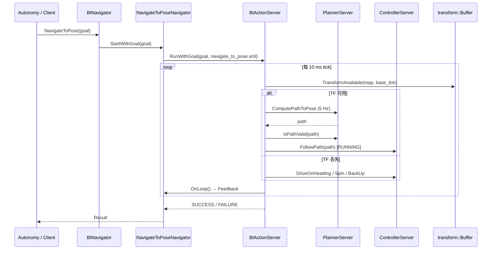
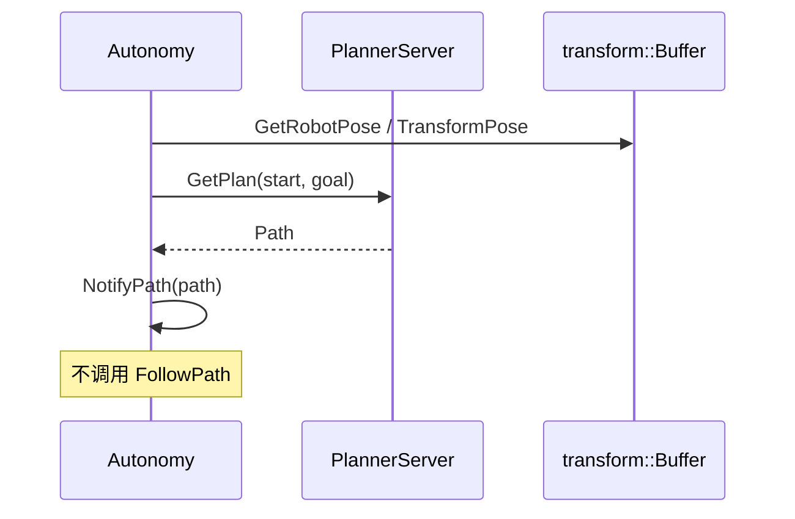
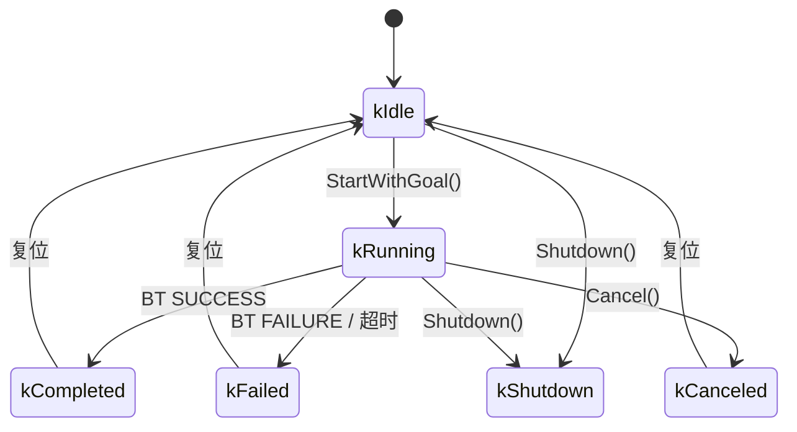

(navigator-architecture)=
# 1. Navigator 模块架构

> 上手与配置见 [§0](00_guide.md)；BT 算法见 [§2–§5](02_bt_algorithms.md)。本文只写 **边界、分层、数据流、插件加载、状态与扩展**。

---

## 1.1 在导航栈中的位置

```
Autonomy / Bridge ──Goal──► BtNavigator ──BT tick──► Planner / Control / Map
                                │
                                ▼
                         navigate_to_pose.xml
```

| 边界 | 说明 |
|------|------|
| 上游 | `system::Autonomy`、Bridge、autolink Action Client |
| 下游 | `planning`、`control`、`map`、`transform` |
| 入口 | `NavigatorOptions`（`navigator.lua`）· `NavigateToPose()` |
| 不负责 | 路径搜索、局部控制律、定位算法 |

设计约束：**nav2 对齐** · **编排不实现算法** · **`common.lua` 三模块共享帧/容差** · **52 BT 插件 `.so`** · **局部生存增强**（TF 丢失时不立即失败）。

---

## 1.2 实现状态

| 组件 | 状态 | 说明 |
|------|------|------|
| `NavigatorOptions` / `options.cpp` | ✅ | Lua → Protobuf 完整 |
| `NavigatorInterface` | ✅ | 生命周期接口 |
| `BehaviorTreeNavigator` 模板 | ✅ | 头文件完整，依赖 BtEngine |
| `NavigatorMuxer` | ✅ | 互斥调度 |
| BT XML（单点/多点） | ✅ | 含局部生存模式 |
| `navigator.lua`（52 插件清单） | ✅ | 与 CMake 目标对齐 |
| `BtEngine` / `BtActionServer` / `BtContext` | ⏳ | 头文件引用存在，实现待恢复 |
| BT 插件 `.so`（52 个） | ⏳ | 源码待从历史 `tasks` 迁回 |
| `BtNavigator` 顶层编排 | ⏳ | 设计完成 |
| `NavigateToPoseNavigator` / `NavigateThroughPosesNavigator` | ⏳ | 设计完成 |
| `Autonomy` BT 接线 | ⏳ | 当前 `use_bt_navigation_ = false` |
| 直驱规划路径 | ✅ | `NavigateDirectToPose` → `GetPlan` |

> **当前阶段**：6 个源文件 + 配置/BT XML 已就绪；完整 BT 栈尚待迁回。`system::Autonomy` 以直驱模式验证规划链路。

## 1.3 分层架构

`navigator` 模块分为 **应用 → BtNavigator → BtEngine → BT 插件 → 子系统** 五层。

<div class="plan-arch-diagram">

  <div class="plan-arch-layer plan-arch-app">
    <div class="plan-arch-header">
      <span class="plan-arch-badge">应用层</span>
      <span class="plan-arch-title">Autonomy / Bridge / nav_test</span>
      <span class="plan-arch-sub">外部调用方，不隶属于 navigator 包</span>
    </div>
    <div class="plan-arch-body">
      <div class="nav-body-block">
        <div class="nav-body-label">对外接口</div>
        <div class="nav-chip-list">
          <span class="nav-chip">NavigateToPose()</span>
          <span class="nav-chip">NavigateThroughPoses()</span>
          <span class="nav-chip">navigate_to_pose Action</span>
        </div>
      </div>
    </div>
  </div>

  <div class="plan-arch-pipe"><span>Goal / Cancel / Feedback</span></div>

  <div class="plan-arch-layer plan-arch-server">
    <div class="plan-arch-header">
      <span class="plan-arch-badge">编排层</span>
      <span class="plan-arch-title">BtNavigator</span>
      <span class="plan-arch-sub">模块唯一对外服务入口 · <code>navigator</code> 节点</span>
    </div>
    <div class="plan-arch-body plan-arch-body-cols">
      <div class="nav-body-block">
        <div class="nav-body-label">核心职责</div>
        <ul>
          <li>持有两个 <code>BehaviorTreeNavigator</code> 实例</li>
          <li><code>NavigatorMuxer</code> 互斥调度</li>
          <li>黑板默认值注入（<code>PopulateBlackboardDefaults</code>）</li>
          <li>Feedback 发布与 Result 错误码映射</li>
        </ul>
      </div>
      <div class="nav-body-block">
        <div class="nav-body-label">具体 Navigator</div>
        <div class="nav-chip-list">
          <span class="nav-chip">NavigateToPoseNavigator</span>
          <span class="nav-chip">NavigateThroughPosesNavigator</span>
        </div>
      </div>
    </div>
  </div>

  <div class="plan-arch-pipe"><span>RunWithGoal / tick</span></div>

  <div class="plan-arch-layer plan-arch-plugin">
    <div class="plan-arch-header">
      <span class="plan-arch-badge">引擎层</span>
      <span class="plan-arch-title">BtEngine + BtActionServer + BtContext</span>
      <span class="plan-arch-sub">BehaviorTree.CPP 工厂 · 100 Hz tick 循环</span>
    </div>
    <div class="plan-arch-body plan-arch-body-cols">
      <div class="nav-body-block">
        <div class="nav-body-label">BtEngine</div>
        <ul>
          <li>加载 52 个插件 <code>.so</code></li>
          <li>解析 BT XML → <code>Tree</code></li>
          <li><code>BehaviorTreeFactory</code> 注册表</li>
        </ul>
      </div>
      <div class="nav-body-block">
        <div class="nav-body-label">BtActionServer</div>
        <ul>
          <li>Goal / Preempt / Cancel 回调</li>
          <li><code>Run()</code> tick 主循环</li>
          <li>黑板与 autolink 节点绑定</li>
        </ul>
      </div>
      <div class="nav-body-block">
        <div class="nav-body-label">BtContext</div>
        <div class="nav-chip-list">
          <span class="nav-chip">planner</span>
          <span class="nav-chip">controller</span>
          <span class="nav-chip">tf_buffer</span>
          <span class="nav-chip">navigator_options</span>
        </div>
      </div>
    </div>
  </div>

  <div class="plan-arch-pipe"><span>Action / Service 调用</span></div>

  <div class="plan-arch-split">
    <div class="plan-arch-layer plan-arch-map">
      <div class="plan-arch-header">
        <span class="plan-arch-badge">插件层</span>
        <span class="plan-arch-title">BT 节点插件（52）</span>
      </div>
      <div class="plan-arch-body">
        <div class="nav-body-block">
          <div class="nav-body-label">类别</div>
          <div class="nav-chip-list">
            <span class="nav-chip">24 Action</span>
            <span class="nav-chip">16 Condition</span>
            <span class="nav-chip">3 Control</span>
            <span class="nav-chip">7 Decorator</span>
          </div>
        </div>
        <div class="nav-body-block">
          <div class="nav-body-label">代表节点</div>
          <div class="nav-chip-list">
            <span class="nav-chip">ComputePathToPose</span>
            <span class="nav-chip">FollowPath</span>
            <span class="nav-chip">RecoveryNode</span>
            <span class="nav-chip">RateController</span>
          </div>
        </div>
      </div>
    </div>

    <div class="plan-arch-link">
      <span class="plan-arch-link-arrow">◄</span>
      <span class="plan-arch-link-text">调用<br/>子系统</span>
      <span class="plan-arch-link-arrow">►</span>
    </div>

    <div class="plan-arch-layer plan-arch-post">
      <div class="plan-arch-header">
        <span class="plan-arch-badge">子系统层</span>
        <span class="plan-arch-title">Planning / Control / Map / TF</span>
      </div>
      <div class="plan-arch-body">
        <div class="nav-body-block">
          <div class="nav-body-label">服务入口</div>
          <div class="nav-chip-list">
            <span class="nav-chip">PlannerServer</span>
            <span class="nav-chip">ControllerServer</span>
            <span class="nav-chip">clear_costmap</span>
            <span class="nav-chip">is_path_valid</span>
            <span class="nav-chip">transform::Buffer</span>
          </div>
        </div>
      </div>
    </div>
  </div>

  <div class="plan-arch-pipe plan-arch-pipe-out"><span>输出：导航 Result + Feedback</span></div>

</div>

### 1.3.1 编排层 — `BtNavigator`

`BtNavigator` 对标 `nav2_bt_navigator::BtNavigator`，职责：

| 职责 | 实现要点 |
|------|----------|
| 生命周期 | 构造时创建 `BtEngine`、加载插件、实例化两个 Navigator |
| 配置注入 | 从 `NavigatorOptions` 读取帧、容差、BT XML 路径 |
| 互斥 | 共享 `NavigatorMuxer`，拒绝并发导航 |
| 黑板初始化 | `PopulateBlackboardDefaults()` 写入 `goal_reached_tol` 等 |
| autolink | `enable_autolink_action_servers` 控制 Action Server 注册 |

### 1.3.2 引擎层 — `BehaviorTreeNavigator<ActionT>`

模板基类（`common/behavior_tree_navigator.hpp`）封装：

```cpp
template <typename ActionT>
class BehaviorTreeNavigator {
    bool StartWithGoal(GoalPtr goal, const std::string& tree_xml = "");
    bool IsRunning() const;
    bool Cancel();
protected:
    virtual bool OnGoalReceived(GoalPtr goal) = 0;
    virtual void OnLoop() = 0;       // 更新 current_pose → Feedback
    virtual void OnPreempt(GoalPtr goal) = 0;
    virtual void OnCompleted(ResultPtr result, RunStatus status) = 0;
};
```

构造时创建 `BtActionServer`，绑定 Goal/Loop/Preempt/Completed 回调，并将 autolink 节点写入黑板。

### 1.3.3 插件层

52 个 BT 节点以独立 `.so` 注册，命名规则：

```
autonomy_behavior_tree_{category}_{stem}
```

详见 [05_bt_plugins.md](05_bt_plugins.md)。

## 1.4 导航数据流

### 1.4.1 BT 单点导航时序



### 1.4.2 直驱模式（当前默认）



### 1.4.3 多点巡航

```
NavigateThroughPoses(goals[])
  → NavigateThroughPosesNavigator
  → navigate_through_poses.xml
  → ComputePathThroughPoses (10 Hz)
  → SmoothPath → IsPathValid → FollowPath
  → RecoveryNode(retries=6)
```

与单点树差异：无局部生存模式、无 ReactiveFallback GoalReached 前置、规划频率 10 Hz。

## 1.5 配置管线

```
config/common.lua                    ← 单一事实来源
        │
        ▼
config/navigator/navigator.lua
        │
        ▼
LuaParameterDictionary
        │
        ▼
navigator::LoadOptions()  →  proto::NavigatorOptions
        │
        ├── global_frame / robot_base_frame
        ├── bt_loop_duration (10 ms)
        ├── local_survival_timeout (120 s)
        ├── goal_reached_tolerance (0.25 m)
        ├── plugin_lib_names (52)
        ├── navigate_to_pose.behavior_tree_file
        └── navigate_through_poses.behavior_tree_file
        │
        ▼
BtNavigator(options)  [待恢复]
        │
        ├── BtEngine::LoadPlugins()
        ├── PopulateBlackboardDefaults()
        └── NavigateToPoseNavigator / NavigateThroughPosesNavigator
```

`NavigatorOptions` proto 主要字段：

| 字段 | 类型 | 说明 |
|------|------|------|
| `bt_loop_duration` | `uint32` | tick 周期 ms，默认 10 |
| `default_server_timeout` | `uint32` | 子 Action 超时 ms |
| `local_survival_timeout` | `double` | 局部生存秒数 |
| `plugin_lib_names` | `repeated string` | BT 插件库名 |
| `navigate_to_pose` | `BehaviorTreeNavigatorOptions` | enable + XML 文件 |

## 1.6 状态机

### 1.6.1 NavigatorInterface 生命周期



### 1.6.2 navigate_to_pose 模式切换

```
                    ┌─────────────┐
                    │ GoalReached?│──YES──→ SUCCESS
                    └──────┬──────┘
                           NO
              ┌────────────┴────────────┐
              ▼                         ▼
     TF available?              TF NOT available
              │                         │
              ▼                         ▼
        GlobalMode              LocalSurvivalMode
     (PipelineSequence)       (RoundRobin + relocalize)
              │                         │
              │    TF restored ◄────────┘
              │                         │
              └──── failure ────────────┘
                           ▼
                  NavigationRecovery (×8)
```

### 1.6.3 NavigatorMuxer 互斥

同一时刻仅允许一个 Navigator 活跃：

```
navigate_to_pose RUNNING  →  navigate_through_poses Goal REJECTED
navigate_through_poses RUNNING  →  navigate_to_pose Goal REJECTED
```

## 1.7 与系统其他模块的集成

```
config/autonomy.lua
  include navigator/navigator.lua
        │
        ▼
system::Autonomy
  navigator_options_ = CreateOptions(...)
  use_bt_navigation_ = false  (当前)
        │
        ├── planner_  ← ComputePathToPose / GetPlan
        ├── controller_  ← FollowPath / Spin / BackUp
        ├── tf_buffer_  ← TransformAvailable
        └── map/costmap  ← IsPathValid / ClearEntireCostmap
```

| 模块 | 集成点 |
|------|--------|
| `planning` | `ComputePathToPose`、`IsPathValid` |
| `control` | `FollowPath`、恢复原语、GoalChecker |
| `map/costmap_2d` | 清图服务、路径碰撞检测 |
| `localization` | 间接通过 TF 影响 `TransformAvailable` |
| `transform` | `Buffer::canTransform` |
| `Bridge` | gRPC 下发 Goal（待 navigator_stub） |

## 1.8 线程与并发

| 场景 | 策略 |
|------|------|
| BT tick 线程 | `BtActionServer::Run()` 独立线程或主循环，周期 10 ms |
| Navigator 互斥 | `NavigatorMuxer` 互斥锁 |
| 子 Action 调用 | 同步等待或 async + cancel_checker |
| TF 查询 | `transform::Buffer` 线程安全读 |
| Costmap vs 规划 | 子系统内部加锁，BT 不直接操作 costmap |

**取消语义**：`Cancel()` → `BtActionServer::Cancel()` → 中止 FollowPath / ComputePath → BT 树 HALTED → `kCanceled`。

## 1.9 扩展指南

### 1.9.1 新增 BT 节点插件

1. 在 `behavior_tree/plugins/{category}/` 实现节点
2. 继承 `BtActionNode` / `BtConditionNode` / `BtControlNode` / `BtDecoratorNode`
3. `BT_REGISTER_NODES(factory)` 注册
4. CMake 添加 `.so` 目标
5. 更新 `navigator.lua` 的 `plugin_lib_names`
6. 更新 `autonomy_tree_nodes.xml`

### 1.9.2 新增 Navigator 类型

1. 定义 Action proto（Goal/Feedback/Result）
2. 继承 `BehaviorTreeNavigator<ActionT>`
3. 实现 `OnGoalReceived`（写黑板）、`OnLoop`（Feedback）、`OnCompleted`（Result）
4. 在 `BtNavigator` 中注册
5. 编写默认 BT XML

### 1.9.3 自定义 BT XML

复制 `navigate_to_pose.xml`，修改后：

- 在 `navigator.lua` 改 `behavior_tree_file`，或
- Goal 的 `behavior_tree` 字段运行时指定

## 1.10 相关文档

- [Navigator 导航编排指南](00_guide.md)
- [数学原理](00_guide.md#03-问题形式化)
- [使用指南](00_guide.md)
- [行为树引擎](03_bt_engine.md)
- [单点导航 BT](04_navigate_to_pose.md)
- [Planning 架构](../08_Planning/01_architecture.md)
