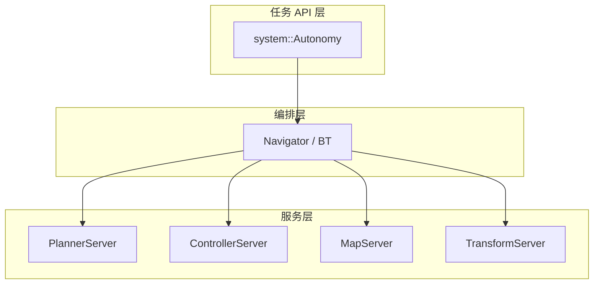

# 5. 任务架构

### 5.1 逻辑分层



### 5.2 启动与配置时序

```
CreateAutonomy(options)
    → Start()        # 启动各 Server
    → Configure()    # 加载 navigator 选项，附着 BT（演进中）
    → NavigateToPose()
    → Shutdown()
```

### 5.3 NavigatorMuxer

同一时刻仅允许一个 Navigator 实例活跃（`navigate_to_pose` 或 `navigate_through_poses`），由 `NavigatorMuxer` 互斥调度。

### 5.4 任务生命周期

| 状态 | 说明 |
|------|------|
| Idle | 无活跃任务 |
| Running | BT tick 或直驱循环中 |
| Completed | 到达目标 |
| Failed | 规划/控制失败 |
| Canceled | 用户取消 |

接口定义：`autonomy/navigator/common/interface.hpp` → `NavigatorInterface`。

### 5.5 与 Bridge 的集成

gRPC Bridge 可将外部请求转为 `NavigateToPose` Action 语义，当前 `navigator_stub` 为桩实现，详见 [15 Bridge](../15_Bridge/01_overview.md)。

### 5.6 相关文档

- [§6 执行模式](06_execution_modes.md)
- [16 Navigator · 架构](../16_Navigator/01_architecture.md)
