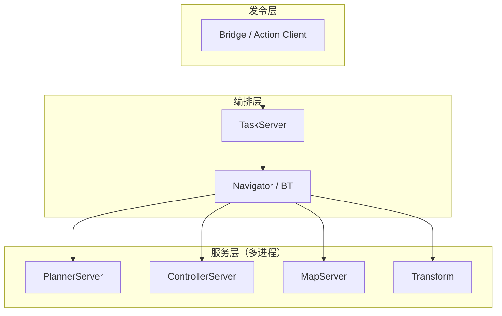

# 5. 任务架构

### 5.1 逻辑分层



### 5.2 启动与配置时序

```
autolink_launch autonomy.launch
    → autonomy.planning / control / task / …
    → TaskServer::Configure + Start
    → Bridge / Action 发令
```

进程内 `CreateAutonomy` **已移除**。

### 5.3 任务互斥

同一时刻通常仅允许一个导航类任务活跃（NavigateToPose 或 ThroughPoses），由 TaskServer / Navigator 侧互斥调度。

### 5.4 任务生命周期

| 状态 | 说明 |
|------|------|
| Idle | 无活跃任务 |
| Running | BT tick 或任务执行中 |
| Completed | 到达目标 |
| Failed | 规划/控制失败 |
| Canceled | 用户取消 |

接口定义：`autonomy/task/navigation/interface.hpp` → `NavigatorInterface`。

### 5.5 与 Bridge 的集成

gRPC Bridge 可将外部请求转为导航 Action 语义，详见 [15 Bridge](../15_Bridge/00_guide.md)。

### 5.6 相关文档

- [§6 执行模式](06_execution_modes.md)
- [16 Navigator · 架构](../16_Navigator/01_architecture.md)
