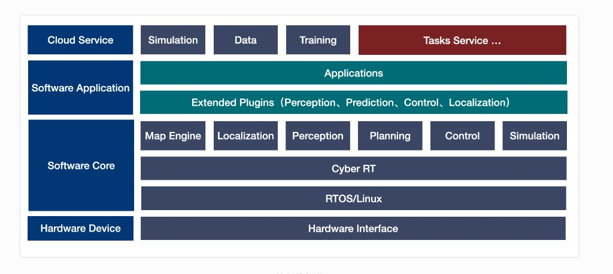

.. Copyright 2026 The OpenRobotic Beginner Authors (duyongquan)

.. Licensed under the Apache License, Version 2.0 (the "License");
   you may not use this file except in compliance with the License.
   You may obtain a copy of the License at

..      http://www.apache.org/licenses/LICENSE-2.0

.. Unless required by applicable law or agreed to in writing, software
   distributed under the License is distributed on an "AS IS" BASIS,
   WITHOUT WARRANTIES OR CONDITIONS OF ANY KIND, either express or implied.
   See the License for the specific language governing permissions and
   limitations under the License.

============
Autonomy
============

`Autonomy <https://github.com/quandy2020/autonomy>`_ 是一套面向移动机器人的 C++ 导航与自主系统框架，涵盖通信、定位、建图、规划、控制、感知与仿真等模块。`源码跳转 <https://github.com/quandy2020/autonomy>`_

   系统分层架构（Cloud Service → Application → Software Core → Hardware）

快速开始
--------

克隆仓库并进入文档目录：

.. code-block:: bash

   git clone --recurse-submodules https://github.com/quandy2020/autonomy.git
   cd autonomy/docs && python3 -m sphinx -b html source build

文档目录
--------

.. toctree::
  :maxdepth: 1

  01 Instructions <01_Instructions/index>
  02 Installation <02_Installation/index>
  03 Communication <03_Communication/index>
  04 Running <04_Running/index>
  05 Framework <05_Framework/index>
  06 Localization <06_Localization/index>
  07 Mapping <07_Map/index>
  08 Planning <08_Planning/index>
  09 Control <09_Control/index>
  10 Perception <10_Perception/index>
  11 Prediction <11_Prediction/index>
  12 Simulation <12_Simulation/index>
  13 Visualization <13_Visualization/index>
  14 Commsgs <14_Commsgs/index>
  15 Bridge <15_Bridge/index>
  16 Navigator <16_Navigator/index>
  17 Tasks <17_Tasks/index>
  18 Tools <18_Tools/index>
  19 FAQ <19_FAQs/index>
  20 Others <20_Other/index>

